# GRFICSv2 Lab: Simulating a Cyber-Physical Attack on an Industrial Chemical Process

This lab uses **GRFICSv2** (Graphical Realism Framework for Industrial Control Simulation, v2), the open-source ICS/OT testbed maintained by [Fortiphyd Logic](https://github.com/Fortiphyd/GRFICSv2), to reproduce a full attack chain against a simulated chemical reactor process: from network reconnaissance to a **physical, destructive consequence** rendered in real time by the simulator. Unlike Lab 01 and Lab 02 (which target a generic Modbus slave), GRFICSv2 couples a real Modbus/TCP control stack (OpenPLC + ScadaBR) to a Unity3D physics simulation of the process, so an unauthorized command sent over the network is not just a packet on the wire, it visibly changes valve positions, pressure, and ultimately the integrity of the equipment.

---

## 📋 Table of Contents
- [🎯 Lab Context and Objective](#-lab-context-and-objective)
- [🏗️ Lab Environment and Network Architecture](#️-lab-environment-and-network-architecture)
- [🔬 Part 01: Understanding the Physical Process (Baseline)](#-part-01-understanding-the-physical-process-baseline)
- [🕵️ Part 02: Man-in-the-Middle via ARP Spoofing](#️-part-02-man-in-the-middle-via-arp-spoofing)
- [📡 Part 03: Modbus/TCP Traffic Interception](#-part-03-modbustcp-traffic-interception)
- [💉 Part 04: Unauthorized Command Injection (Metasploit `modbusclient`)](#-part-04-unauthorized-command-injection-metasploit-modbusclient)
- [🛠️ Part 05: PLC Logic Tampering via OpenPLC](#️-part-05-plc-logic-tampering-via-openplc)
- [💥 Part 06: Physical Consequence: Overpressure and Explosion](#-part-06-physical-consequence-overpressure-and-explosion)
- [📊 Findings & Security Assessment](#-findings--security-assessment)
- [🛡️ Recommended Mitigations](#️-recommended-mitigations)
- [🧰 Tools Used](#-tools-used)
- [⚖️ Disclaimer](#️-disclaimer)

---

## 🎯 Lab Context and Objective

GRFICSv2 simulates a small chemical plant: two feed streams (**A**, **B**) enter a pressurized reactor, react, and are separated into a **Purge** stream and a **Product** stream. Valve positions, flow rates, tank level, and reactor pressure are all exposed as Modbus registers/coils, polled and controlled by a SCADA HMI (**ScadaBR**) through a software PLC (**OpenPLC**).

The objective of this lab is to demonstrate, end to end, how the same class of attacks introduced in Lab 01 (reconnaissance) and Lab 02 (Modbus command injection, MITM) translate into an actual **loss of safe operation** when the target is a realistic ICS stack rather than an isolated Modbus slave:

1. **Reconnaissance & MITM positioning**: intercept traffic between the HMI and the PLC via ARP spoofing.
2. **Command injection**: force a process actuator open/closed directly via an unauthenticated Modbus write.
3. **Engineering-level tampering**: go further than a single coil write and reprogram the PLC's own control logic (setpoints) through the engineering workstation.
4. **Observe the physical impact**: the simulated reactor overpressures and explodes, illustrating why ICS security failures are safety failures, not just data-confidentiality failures.

---

## 🏗️ Lab Environment and Network Architecture

The lab was built entirely in **VirtualBox**. The official GRFICSv2 OVA appliances were imported and connected on internal networks, and a separate **Kali Linux VM** was added as the attacker machine, reachable from the DMZ segment where the HMI lives.

GRFICSv2 ships with five VMs across two segments ([source](https://github.com/Fortiphyd/GRFICSv2)):

| VM | Role | Address |
|---|---|---|
| **ScadaBR** | HMI / SCADA, operator interface, Modbus TCP master | `192.168.90.5` (DMZ) |
| **pfSense** | Firewall/router between DMZ and ICS segments | `192.168.90.100` (WAN) / `192.168.95.1` (LAN) |
| **plc_2** | OpenPLC, Modbus TCP slave, drives the process | `192.168.95.2` (ICS) |
| **ChemicalPlant** | Unity3D physics simulation of the reactor, exposed via a JSON API | `192.168.95.10`-`.15` (ICS) |
| **Workstation** | Engineering station (OpenPLC Editor / IDE) | `192.168.95.5` (ICS) |
| **Kali** *(added for this lab)* | Attacker machine | DMZ segment, same broadcast domain as ScadaBR |

> ⚠️ **Note on timestamps:** the on-screen clock burned into the simulator's HMI (e.g. `11-16-2020`) is the Unity simulation's own internal clock, unrelated to the real capture date. The actual lab was run on the dates shown by the screenshot filenames below.

---

## 🔬 Part 01: Understanding the Physical Process (Baseline)

Before attempting any attack, the process was observed under normal operation to understand its safe operating envelope: feed rates for streams A and B, reactor level and pressure, and the purge/product composition.

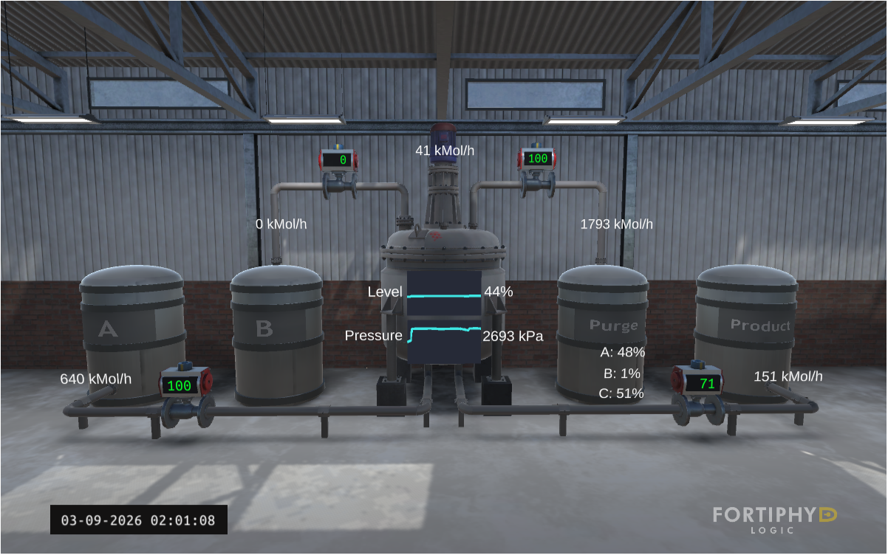

To confirm where the danger threshold actually was, the outlet valves were then manually restricted directly from the HMI (no attack yet, just process exploration). Closing the outlet while feed continues traps mass and energy inside the reactor: pressure climbs past **3000 kPa** and the vessel begins to visibly crack and vent.

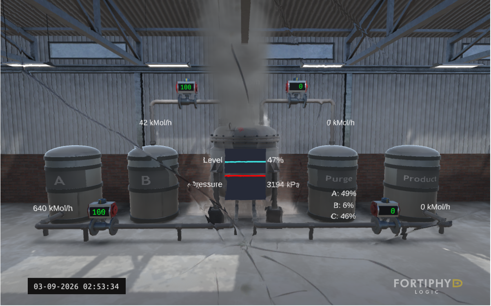

This confirmed the attack hypothesis for the rest of the lab: **any actor who can command the reactor's valves, legitimately or not, can drive the process into an unsafe state.**

---

## 🕵️ Part 02: Man-in-the-Middle via ARP Spoofing

From Kali, `arpspoof` (dsniff suite) was used to poison the ARP cache of the HMI (`192.168.90.5`), redirecting its traffic through the attacker:

```bash
sudo arpspoof 192.168.90.5
```

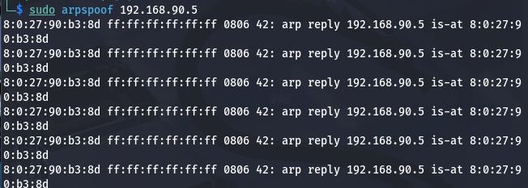

---

## 📡 Part 03: Modbus/TCP Traffic Interception

With the MITM position established, Wireshark confirmed the interception of Modbus/TCP traffic (port `502`) flowing between the HMI (`192.168.90.5`) and the PLC (`192.168.95.2`): the normal polling traffic ScadaBR generates to read/write process variables.

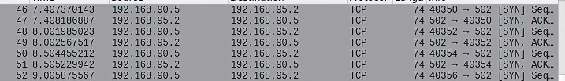

* **Vulnerability highlighted:** as in Lab 01/02, Modbus/TCP carries no authentication or encryption, so a MITM position is enough to read and, more importantly, to *inject* traffic that the PLC will treat as legitimate.

---

## 💉 Part 04: Unauthorized Command Injection (Metasploit `modbusclient`)

Rather than replaying captured traffic, the attack used Metasploit's `auxiliary/scanner/scada/modbusclient` module directly against the PLC to issue an unsolicited **Write Coils** request:

```text
msf5 auxiliary(scanner/scada/modbusclient) > set rhost 192.168.95.2
msf5 auxiliary(scanner/scada/modbusclient) > set action WRITE_COILS
msf5 auxiliary(scanner/scada/modbusclient) > set data_address 40
msf5 auxiliary(scanner/scada/modbusclient) > set number 1
msf5 auxiliary(scanner/scada/modbusclient) > set data_coils 1
msf5 auxiliary(scanner/scada/modbusclient) > run

[*] Running module against 192.168.95.2
[*] 192.168.95.2:502 - Sending WRITE COILS...
[+] 192.168.95.2:502 - Values 1 successfully written from coil address 40
```

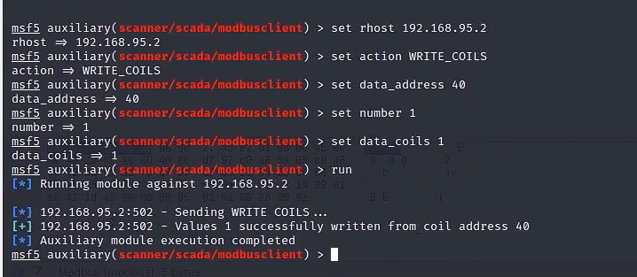

The HMI immediately reflects the effect of the forged command: the feed valve state changes with no operator action and no request from ScadaBR, since the command came directly from the attacker, straight past the legitimate control loop.

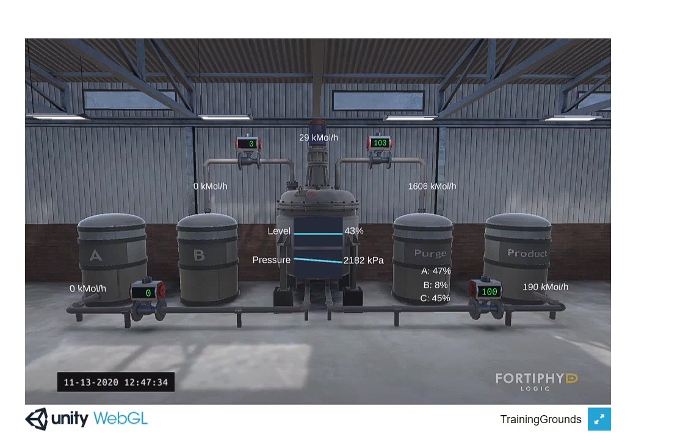

* **Key point:** this single unauthenticated write is enough to move a physical actuator. No credentials, no exploit, just a raw Modbus function code accepted at face value by the PLC, exactly the finding already documented in Lab 01/02.

---

## 🛠️ Part 05: PLC Logic Tampering via OpenPLC

A single coil write is a blunt instrument. To make the attack repeatable and harder to notice, the next step went after the **control logic itself** on the Workstation VM, using OpenPLC Editor to build a modified program (`/home/workstation/Documents/attack/build`) that overrides the PLC's internal setpoints (`a_sp`, `flow_sp`, `level_sp`, `over_sp`, `press_sp`) with attacker-chosen constants instead of the values the process actually needs:

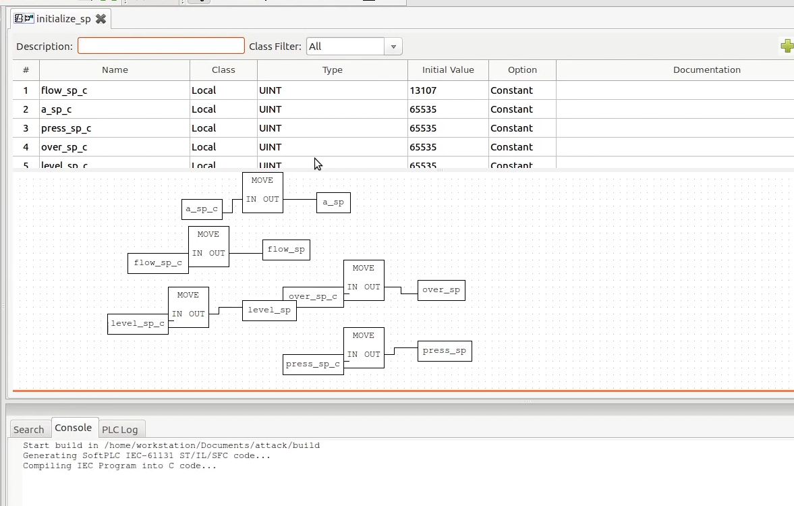

The compiled program is then pushed to the PLC through OpenPLC Runtime's own web management interface (`http://192.168.95.2:8080`), which exposes an unauthenticated **"Change PLC Program"** upload form:

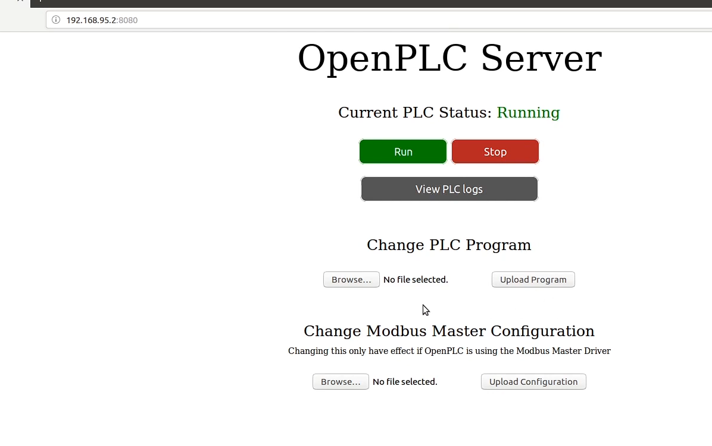

* **Key point:** the engineering interface used to legitimately maintain the PLC has no authentication in this configuration. Anyone who can reach `192.168.95.2:8080`, including an attacker pivoting through the DMZ, can replace the entire control program, not just force individual points.

---

## 💥 Part 06: Physical Consequence: Overpressure and Explosion

With the tampered logic and forced valve state in place, the process drifts out of its safe envelope exactly as anticipated in Part 01: reactor pressure climbs past **3000 kPa** while the relief paths remain shut, and the vessel begins venting under stress.

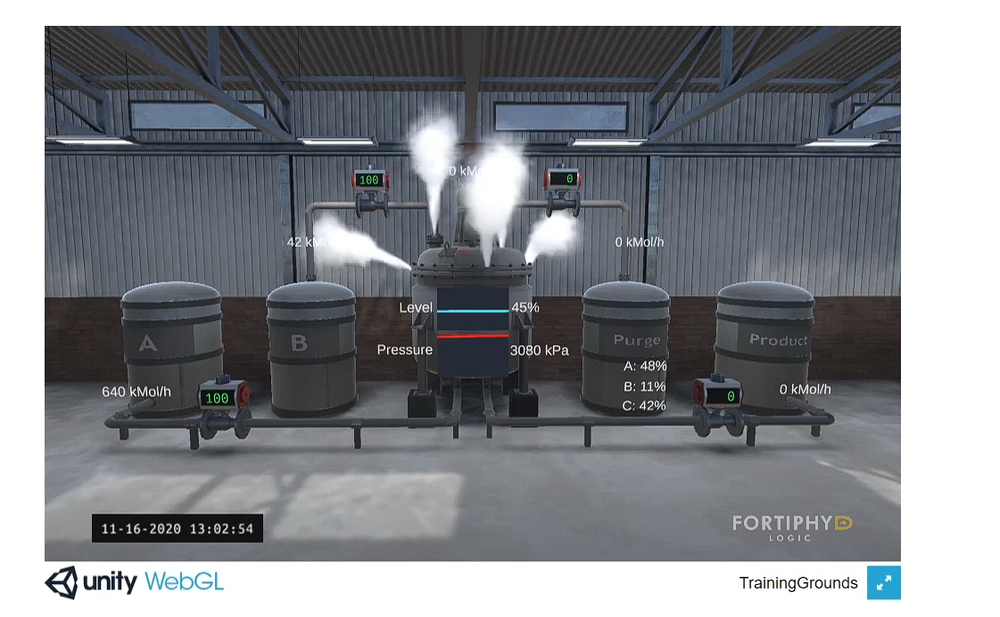

Seconds later, the simulated reactor fails catastrophically:

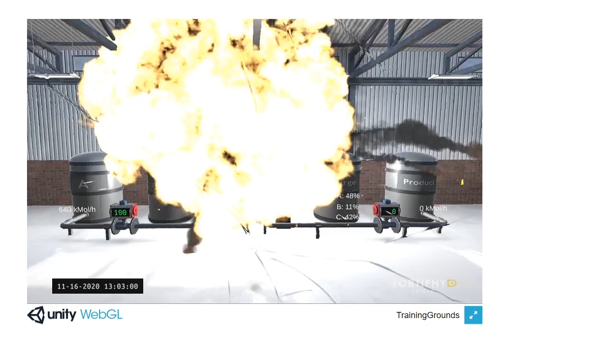

A final Wireshark capture, filtered on `modbus`, shows the PLC and HMI still cheerfully exchanging `Read Coils` / `Read Input Registers` traffic on port 502 throughout the incident: the protocol itself has no concept of the physical damage it just caused, and would just as happily keep polling a destroyed vessel.

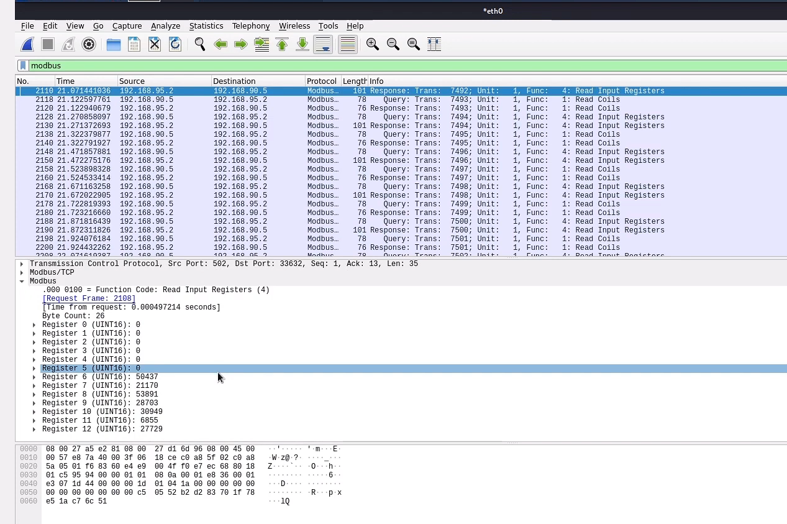

---

## 📊 Findings & Security Assessment

| Asset / Vector | Observation | Security Assessment |
|---|---|---|
| **HMI to PLC segment (DMZ to ICS)** | Flat, switched network, no port security observed | ARP spoofing succeeded with no detection |
| **Modbus/TCP (port 502)** | Plaintext, no authentication, no integrity check | Any host that can reach the PLC can read *and write* process data |
| **Write Coils (FC05/FC15)** | Accepted from an arbitrary source IP with no session context | A single crafted packet forced a physical actuator |
| **OpenPLC Runtime web UI (`:8080`)** | Program upload exposed with no login required | Full control-logic replacement possible from the network, not just point-level tampering |
| **Physical process** | No independent safety layer (e.g. a hard-wired pressure relief / SIS) enforced outside the PLC's own logic | Once the PLC's logic is compromised, nothing else stops the overpressure |

---

## 🛡️ Recommended Mitigations

Consistent with the recommendations from Lab 01 and Lab 02, and aligned with **IEC 62443** and the **Purdue Model**:

1. **Network segmentation & zoning.** The DMZ (HMI) and ICS (PLC/simulation) segments should be separated by a firewall enforcing a strict allow-list (e.g. only ScadaBR to PLC on port 502), not a flat switched network where ARP spoofing is trivial.
2. **Independent Safety Instrumented System (SIS).** Overpressure protection (a relief valve, a hard-wired trip) must not depend on the same PLC logic that operators, or attackers, can reprogram. A compromised control loop should never be the last line of defense.
3. **Authentication on engineering interfaces.** The OpenPLC Runtime web management page (program upload, start/stop) must require authentication and, ideally, be reachable only from a dedicated engineering VLAN.
4. **Modbus/TCP hardening.** Where legacy Modbus cannot be replaced, tunnel it over IPsec/TLS, and deploy an OT-aware IDS (e.g. Suricata with Modbus rules, per Lab 03) to alert on unsolicited writes or unexpected function codes reaching the PLC.
5. **ARP/Layer-2 defenses.** Enable Dynamic ARP Inspection or static ARP entries on critical HMI-PLC links to prevent MITM positioning as a first step of the attack chain.

---

## 🧰 Tools Used

| Tool | Role |
|---|---|
| **GRFICSv2** (Fortiphyd Logic) | ICS/OT testbed: simulated chemical process, OpenPLC, ScadaBR, pfSense |
| **VirtualBox** | Hypervisor hosting the GRFICSv2 VMs and the Kali attacker VM |
| **Kali Linux** | Attacker platform |
| **arpspoof** (dsniff) | ARP cache poisoning / MITM positioning |
| **Wireshark** | Modbus/TCP traffic capture and analysis |
| **Metasploit** (`auxiliary/scanner/scada/modbusclient`) | Unauthorized Modbus Write Coils command injection |
| **OpenPLC Editor / Runtime** | Engineering workstation IDE and PLC runtime targeted for logic tampering |

---

## ⚖️ Disclaimer

This lab was carried out entirely inside an isolated **VirtualBox** environment using the official GRFICSv2 simulation appliances, for educational purposes only. None of the techniques described here were used against real industrial equipment or production networks. GRFICSv2 is intentionally left unhardened by its authors to serve as a safe training target: the vulnerabilities described are expected and documented behavior of the testbed, not a disclosure about any real product.
