# Lab 01: Getting Started with PLCs and HMI/SCADA Supervision

---

## 📋 Table of Contents
- [🎯 Problem Statement and Lab Context](#-problem-statement-and-lab-context)
- [⚙️ Part 01: Introduction and Installation of OpenPLC](#️-part-01-introduction-and-installation-of-openplc)
  - [1. OpenPLC Editor](#1-openplc-editor)
  - [2. OpenPLC Runtime v4](#2-openplc-runtime-v4)
- [🔄 Part 02: Control Loop Logic (Ladder Diagram)](#-part-02-control-loop-logic-ladder-diagram)
  - [1. Process Description and Safety Requirements](#1-process-description-and-safety-requirements)
  - [2. Variable Declaration Table](#2-variable-declaration-table)
  - [3. OpenPLC Editor Implementation & Ladder Diagram](#3-openplc-editor-implementation--ladder-diagram)
  - [4. Compilation, Deployment, and Runtime Execution](#4-compilation-deployment-and-runtime-execution)
- [🖥️ Part 03: Introduction and Installation of ScadaBR](#️-part-03-introduction-and-installation-of-scadabr)
- [🔌 Part 04: ScadaBR Configuration and Modbus TCP Interconnection](#-part-04-scadabr-configuration-and-modbus-tcp-interconnection)
  - [1. Modbus TCP Server Verification in OpenPLC Runtime](#1-modbus-tcp-server-verification-in-openplc-runtime)
  - [2. Modbus IP Data Source Configuration (`Plant01`)](#2-modbus-ip-data-source-configuration-plant01)
  - [3. Mapping and Declaration of Data Points](#3-mapping-and-declaration-of-data-points)
  - [4. Real-Time Monitoring via Watch List](#4-real-time-monitoring-via-watch-list)
  - [5. Graphical HMI Supervision Interface](#5-graphical-hmi-supervision-interface)
- [🔍 Part 05: Network Reconnaissance with Nmap & Wireshark](#-part-05-network-reconnaissance-with-nmap--wireshark)
  - [1. Host Discovery via ARP Scan](#1-host-discovery-via-arp-scan)
  - [2. Service Identification & Modbus TCP Verification](#2-service-identification--modbus-tcp-verification)
  - [3. Traffic Analysis with Wireshark](#3-traffic-analysis-with-wireshark)
- [📊 Identification & Synthesis Results](#-identification--synthesis-results)
- [🛡️ Recommended Mitigation & Hardening](#️-recommended-mitigation--hardening)

---

## 🎯 Problem Statement and Lab Context

In Industrial Control Systems (**ICS**) and Operational Technology (**OT**), operational reliability and functional safety rely on a strict separation between low-level **real-time control logic** (executed at the field level by a Programmable Logic Controller / PLC) and the **supervisory interface** (operated via HMI/SCADA systems).

The primary objective of this practical work is to design, verify, and secure an automated industrial control loop:
1. **Low-Level Control Reliability:** Ensuring physical safety conditions (Emergency Stop, thermal overload protection, door enclosure interlocks) systematically override operator commands.
2. **OT Network Interoperability:** Interconnecting a software PLC (OpenPLC) with a SCADA platform (ScadaBR) using the standard **Modbus TCP** industrial protocol.
3. **Security Assessment & Network Auditing:** Mapping and analyzing industrial LAN traffic to assess asset visibility and evaluate vulnerabilities inherent to unencrypted industrial telemetry protocols.

> 🖥️ **Lab environment note:** the entire OpenPLC + ScadaBR stack runs on a single personal host machine (Windows). Network reconnaissance in Part 05 is performed from a **separate Kali VM** connected to the same LAN — this distinction explains the two different addressing schemes used later in the document (loopback vs. LAN IP).

---

## ⚙️ Part 01: Introduction and Installation of OpenPLC

OpenPLC is an open-source Programmable Logic Controller (**PLC**) suite. It executes industrial control logic according to the **IEC 61131-3** international standard to drive physical or virtual inputs/outputs and manage automated industrial processes.

### 1. OpenPLC Editor

**Description:**  
OpenPLC Editor is the Integrated Development Environment (**IDE**). It is used to write PLC programs in standard languages (Ladder Diagram, Structured Text, Instruction List, etc.), compile them, and prepare them for deployment.

**Installation Procedure:**
- Download the installer from the official OpenPLC website and execute it.
- Follow the setup wizard steps to complete the installation.

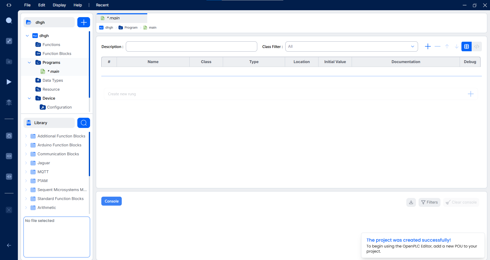

---

### 2. OpenPLC Runtime v4

**Description:**  
OpenPLC Runtime is the execution engine that runs on the host machine acting as the controller. It executes the compiled PLC code cyclically. OpenPLC Runtime exposes a web management interface on port **8080** to configure I/O drivers, load `.st` programs, start/stop execution, and monitor process status.

**Installation Procedure:**
- Download and run the OpenPLC Runtime v4 installer.
- Start the runtime service and access the web management dashboard at `http://localhost:8080`.

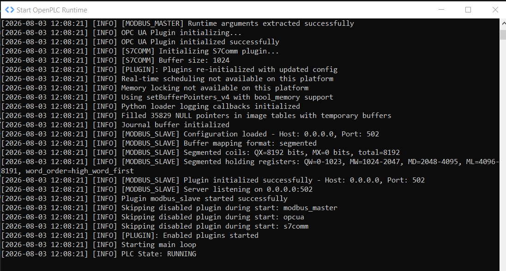

---

## 🔄 Part 02: Control Loop Logic (Ladder Diagram)

### 1. Process Description and Safety Requirements

The control loop governs a main drive motor (`M1`), a cooling fan (`F1`), and status indicator lamps (`RUN` and `FAULT`).

#### A. Safety Inputs (Prioritized Physical Safety)
The system monitors three safety conditions represented by boolean inputs configured with "Normally Closed / Positive Safety" logic:
* `E_STOP_OK` (`%IX0.0`): Emergency Stop button (`1` = Closed circuit / Healthy, `0` = Actuated / Fault).
* `OL_M1_OK` (`%IX0.1`): Motor thermal overload relay (`1` = Healthy, `0` = Tripped / Fault).
* `DOOR_OK` (`%IX0.2`): Enclosure safety door interlock switch (`1` = Closed / Healthy, `0` = Open / Fault).

#### B. Global Permissive Condition (`SAFETY_OK`)
`SAFETY_OK` is an internal permissive condition. It evaluates to `1` if and only if all three safety inputs are `1` simultaneously:

```text
SAFETY_OK = E_STOP_OK AND OL_M1_OK AND DOOR_OK
```

If any safety input drops to `0` (e.g., Emergency Stop pressed, overload tripped, or enclosure door opened), `SAFETY_OK` immediately transitions to `0`.

#### C. Run Latch Circuit (`RUN_LATCH`) & Motor (`M1_RUN`)
The control logic enforces two fundamental safety behaviors:
1. A `STOP` command always de-energizes the motor.
2. Any safety trip immediately stops the motor, regardless of operator inputs.

* **Activation (Latch):** When the operator issues a `START` command (`%QX0.0`) while `SAFETY_OK = 1`, the internal latch variable `RUN_LATCH` is set to `1`.
* **Deactivation (Unlatch):** If `STOP` (`%QX0.1`) is pressed OR `SAFETY_OK` becomes `0`, `RUN_LATCH` is reset to `0`.
* **Motor Command Output (`M1_RUN` - `%QX1.0`):** Drives the motor contactor following `RUN_LATCH`:
  - `RUN_LATCH = 1`: Motor is ENERGIZED.
  - `RUN_LATCH = 0`: Motor is DE-ENERGIZED.

#### D. Status Indicator Lamps
* **Green RUN Light (`%QX1.1`):** Operational status indicator; active when `M1_RUN` is `1`.
* **Red FAULT Light (`%QX1.2`):** Safety interlock fault indicator; active whenever `SAFETY_OK` is `0`.

#### E. Cooling Fan Logic `F1` (`%QX1.3`)
The fan operates in dual mode:
1. **AUTO Mode (`AUTO = 1`):** The fan follows motor operation (ON when motor is running, OFF when motor stops).
2. **MANUAL Mode (`AUTO = 0`):** The fan is independently controlled via dedicated operator command `CMD_FAN` (`%QX0.2`).

---

### 2. Variable Declaration Table

| No. | Variable Name | Class / Type | Data Type | Location / Modbus Address | Description |
|---|---|---|---|---|---|
| **0** | `E_STOP_OK` | Local | `BOOL` | `%IX0.0` | Safety Input: Emergency Stop Button |
| **1** | `OL_M1_OK` | Local | `BOOL` | `%IX0.1` | Safety Input: Motor Overload Relay |
| **2** | `DOOR_OK` | Local | `BOOL` | `%IX0.2` | Safety Input: Enclosure Door Interlock |
| **3** | `START` | Local | `BOOL` | `%QX0.0` | Operator Input: Process Start Command |
| **4** | `STOP` | Local | `BOOL` | `%QX0.1` | Operator Input: Process Stop Command |
| **5** | `CMD_FAN` | Local | `BOOL` | `%QX0.2` | Operator Input: Fan Manual Command |
| **6** | `AUTO` | Local | `BOOL` | `%QX0.3` | Mode Selector: 1 = AUTO, 0 = MANUAL |
| **7** | `SAFETY_OK` | Local | `BOOL` | Internal | Global Safety Permissive Variable |
| **8** | `RUN_LATCH` | Local | `BOOL` | Internal | Motor Run Internal Latch Memory |
| **9** | `M1_RUN` | Local | `BOOL` | `%QX1.0` | Physical Output / Coil: Motor M1 Contactor |
| **10** | `RUN` | Local | `BOOL` | `%QX1.1` | Physical Output / Coil: Green Indicator Lamp |
| **11** | `FAULT` | Local | `BOOL` | `%QX1.2` | Physical Output / Coil: Red Fault Lamp |
| **12** | `F1` | Local | `BOOL` | `%QX1.3` | Physical Output / Coil: Fan F1 Contactor |

---

### 3. OpenPLC Editor Implementation & Ladder Diagram

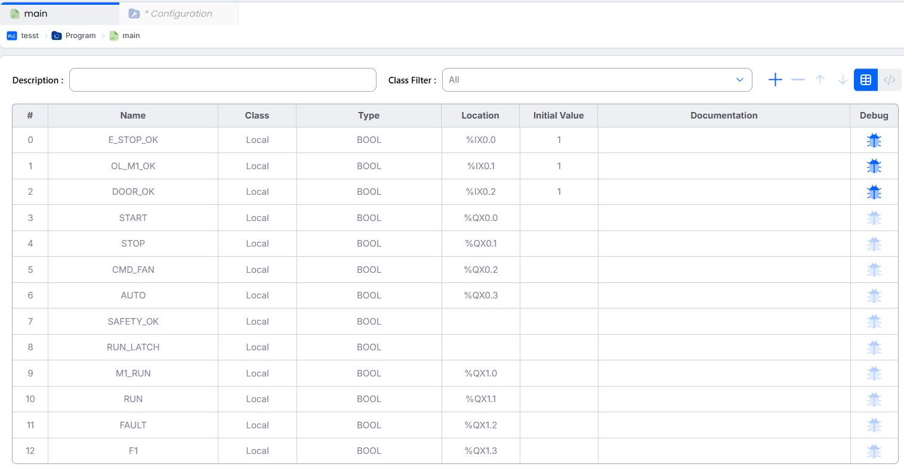


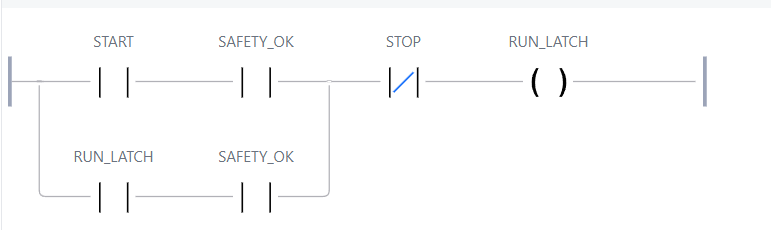
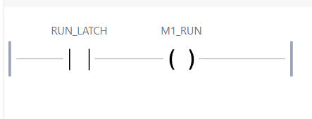
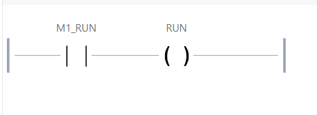

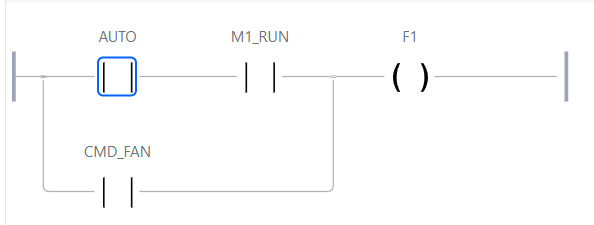

---

### 4. Compilation, Deployment, and Runtime Execution

After compiling the Ladder logic in OpenPLC Editor, the generated `.st` (Structured Text) file is uploaded to OpenPLC Runtime v4:

1. Navigate to `http://localhost:8080`.
2. Select **Programs** $\rightarrow$ **Choose File** $\rightarrow$ Select the compiled `.st` file.
3. Start process execution by clicking **Start PLC**.
4. Confirm Modbus TCP Server activation on port `502`.

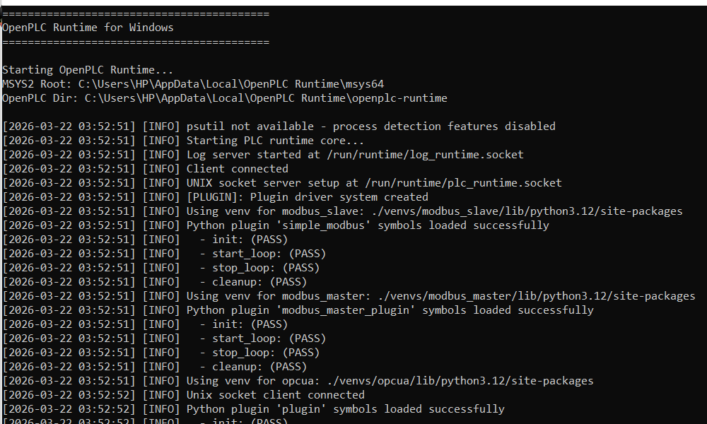

---

## 🖥️ Part 03: Introduction and Installation of ScadaBR

ScadaBR is an open-source Supervisory Control and Data Acquisition (**SCADA**) / **HMI** platform built on Java and Apache Tomcat. It provides centralized real-time telemetry, remote supervisory control, historical data logging, and alarm management for industrial processes.

**Architecture and Setup:**
- ScadaBR requires Java Runtime Environment (JRE/JDK 8) running inside an Apache Tomcat application container.
- Once the Tomcat server is started, the SCADA web interface is accessible at `http://localhost:8080/ScadaBR`.

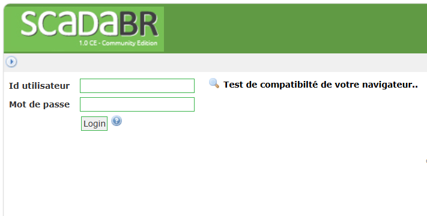

---

## 🔌 Part 04: ScadaBR Configuration and Modbus TCP Interconnection

This section details the integration between OpenPLC Runtime (acting as Modbus TCP Server / Slave) and ScadaBR (acting as Modbus TCP Client / Master).

---

### 1. Modbus TCP Server Verification in OpenPLC Runtime

To enable data acquisition and remote commands from the SCADA system, the Modbus TCP server is configured under **Modbus TCP Slave Server** in OpenPLC Runtime.

* **Network Settings:**
  - **Enable Server:** Enabled (`ON` - starts automatically with PLC execution).
  - **Network Interface:** `All Interfaces (0.0.0.0)` listening on all network cards.
  - **Port:** `502` (Standard Modbus TCP Port).

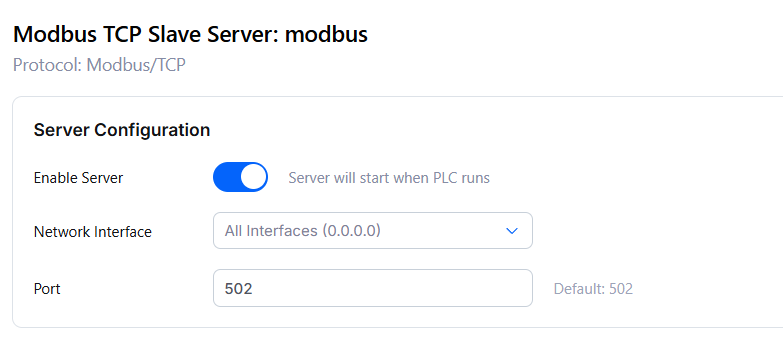

---

### 2. Modbus IP Data Source Configuration (`Plant01`)

In ScadaBR, a `Modbus IP` **Data Source** is created to periodically poll the OpenPLC controller.

> 🖥️ **Topology note:** OpenPLC Runtime and ScadaBR run on the **same host machine** (Windows). ScadaBR therefore polls OpenPLC's Modbus TCP server over the loopback interface (`127.0.0.1`) — the two services never actually leave the physical machine to talk to each other at this stage.

* **Data Source Parameters (`Plant01`):**
  - **Name:** `Plant01` (XID: `DS_320460`).
  - **Connection Type:** `Modbus IP`.
  - **Host Address:** `127.0.0.1` (Localhost / target PLC IP).
  - **Modbus Port:** `502`.
  - **Transport Type:** `TCP with keep-alive`.
  - **Update Rate:** `1 minute(s)` (or adjusted based on polling requirements).
  - **Timeout / Retries:** `500 ms` / `2`.
  - **Status:** Active (Green indicator).

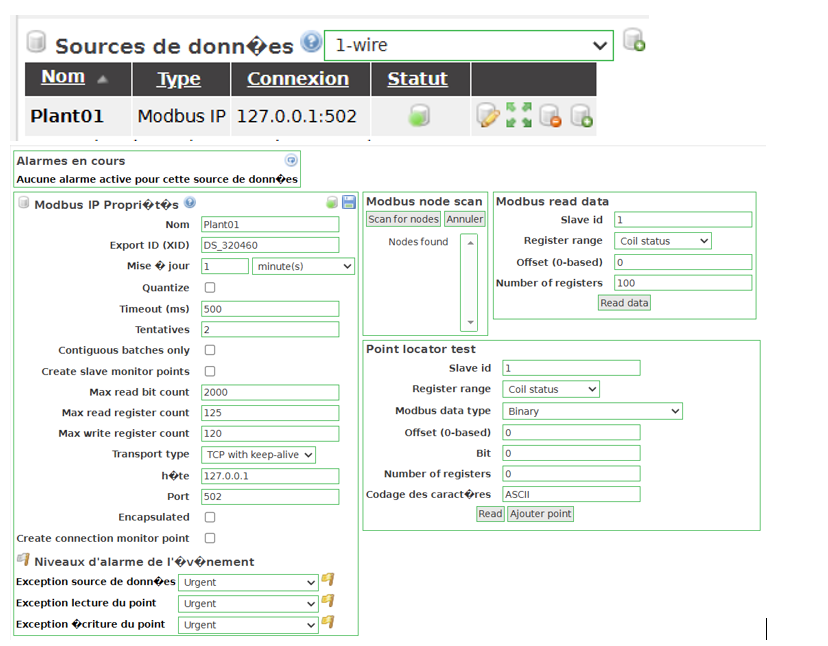

---

### 3. Mapping and Declaration of Data Points

Each variable from OpenPLC is mapped into ScadaBR as a **Data Point**, adhering to OpenPLC's standard Modbus memory mapping:

* **`Input status` Zone (Read-Only Discrete Inputs):**
  - `%IX0.0` $\rightarrow$ **`E_STOP_OK`** (Range: `Input status`, Offset: `0`, Slave ID: `1`, Type: `Binary`)
  - `%IX0.1` $\rightarrow$ **`OL_M1_OK`** (Range: `Input status`, Offset: `1`, Slave ID: `1`, Type: `Binary`)
  - `%IX0.2` $\rightarrow$ **`DOOR_OK`** (Range: `Input status`, Offset: `2`, Slave ID: `1`, Type: `Binary`)

* **`Coil status` Zone (Read/Write Digital Outputs & Commands):**
  - `%QX0.0` $\rightarrow$ **`START`** (Range: `Coil status`, Offset: `0`, Slave ID: `1`, Type: `Binary`)
  - `%QX0.1` $\rightarrow$ **`STOP`** (Range: `Coil status`, Offset: `1`, Slave ID: `1`, Type: `Binary`)
  - `%QX0.2` $\rightarrow$ **`CMD_FAN`** (Range: `Coil status`, Offset: `2`, Slave ID: `1`, Type: `Binary`)
  - `%QX0.3` $\rightarrow$ **`AUTO`** (Range: `Coil status`, Offset: `3`, Slave ID: `1`, Type: `Binary`)
  - `%QX1.0` $\rightarrow$ **`M1_RUN`** (Range: `Coil status`, Offset: `8`, Slave ID: `1`, Type: `Binary`)
  - `%QX1.1` $\rightarrow$ **`RUN`** (Range: `Coil status`, Offset: `9`, Slave ID: `1`, Type: `Binary`)
  - `%QX1.2` $\rightarrow$ **`FAULT`** (Range: `Coil status`, Offset: `10`, Slave ID: `1`, Type: `Binary`)
  - `%QX1.3` $\rightarrow$ **`F1`** (Range: `Coil status`, Offset: `11`, Slave ID: `1`, Type: `Binary`)

#### Summary Table of Configured Data Points in ScadaBR

| Point Name | Data Type | Status | Slave ID | Register Range | Offset (0-based) | Description / Function |
|---|---|---|---|---|---|---|
| **AUTO** | Binary | Active | 1 | Coil status | 3 | Automatic Mode Selector (`%QX0.3`) |
| **CMD_FAN** | Binary | Active | 1 | Coil status | 2 | Fan Manual Command (`%QX0.2`) |
| **DOOR_OK** | Binary | Active | 1 | Input status | 2 | Door Interlock Safety Input (`%IX0.2`) |
| **E_STOP_OK** | Binary | Active | 1 | Input status | 0 | Emergency Stop Safety Input (`%IX0.0`) |
| **F1** | Binary | Active | 1 | Coil status | 11 | Cooling Fan Command Output (`%QX1.3`) |
| **FAULT** | Binary | Active | 1 | Coil status | 10 | Red Fault Indicator Lamp (`%QX1.2`) |
| **M1_RUN** | Binary | Active | 1 | Coil status | 8 | Motor M1 Contactor Output (`%QX1.0`) |
| **OL_M1_OK** | Binary | Active | 1 | Input status | 1 | Thermal Overload Safety Input (`%IX0.1`) |
| **RUN** | Binary | Active | 1 | Coil status | 9 | Green RUN Indicator Lamp (`%QX1.1`) |
| **START** | Binary | Active | 1 | Coil status | 0 | Start Push Button Command (`%QX0.0`) |
| **STOP** | Binary | Active | 1 | Coil status | 1 | Stop Push Button Command (`%QX0.1`) |


---

### 4. Real-Time Monitoring via Watch List

The **Watch List** validates real-time bidirectional communication between OpenPLC and ScadaBR.

* **State Analysis from Capture:**
  - **Safety Inputs:** `E_STOP_OK = 1`, `OL_M1_OK = 1`, `DOOR_OK = 1`. All safety inputs satisfied (`SAFETY_OK = 1`).
  - **Commands:** `START = 1`, `STOP = 0`, `AUTO = 0` (Manual Mode), `CMD_FAN = 1`.
  - **Process State:** `M1_RUN = 1` (Motor Running), `F1 = 1` (Fan Active via manual command), `RUN = 1` (Green Lamp ON), `FAULT = 0` (No Alarm).

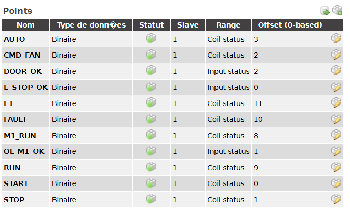

---

### 5. Graphical HMI Supervision Interface

The **Graphical View** provides operators with a visual, interactive synoptic diagram of the physical process.

* **Configured Dynamic Components:**
  - **Safety Status Lamps (Left):** Visual indicators displaying the status of the 3 safety inputs (`E-STOP`, `OL OK`, `DOOR`). Displayed in green when healthy (`1`).
  - **Operator Action Buttons (Center):** Interactive push buttons to toggle Modbus Coils: `START` (`ON`), `STOP` (`OFF`), `AUTO/MAN` selector, and `Ventilateur_MAN` (`ON`).
  - **Actuators and Indicators (Right & Top):**
    - **RUN Lamp (Green):** Indicates active motor operation (`1`).
    - **FAULT Lamp (Red):** Illuminates in case of a safety interlock trip (`0`).
    - **Motor Animation (`M1`):** Dynamic graphic indicating motor status (illuminates green when `M1_RUN = 1`).
    - **Fan Animation (`F1`):** Dynamic graphic indicating fan operation (`1`) controlled via auto logic or manual override.

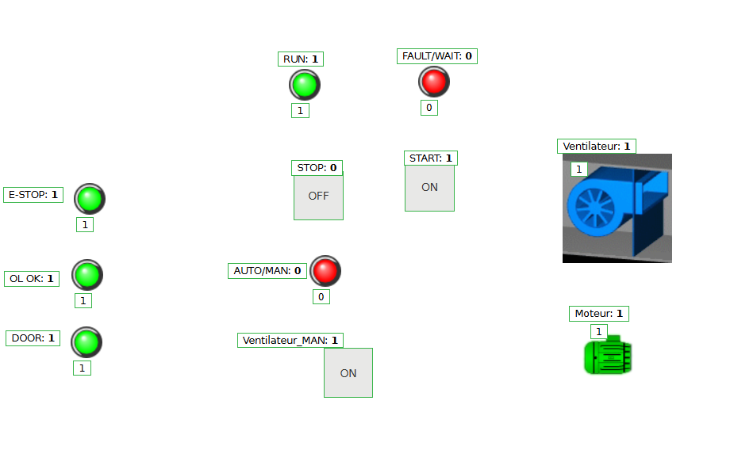

---

## 🔍 Part 05: Network Reconnaissance with Nmap & Wireshark

> 🖥️ **Topology note:** unlike Part 04 (where ScadaBR and OpenPLC talk to each other locally via `127.0.0.1`), the reconnaissance in this part is launched from a **separate Kali VM** sitting on the same LAN as the Windows host. From Kali's point of view, `127.0.0.1` would refer to Kali itself — so the target is instead scanned via the Windows host's real LAN-facing address (`192.168.11.103`), which is where OpenPLC's Modbus TCP server is actually reachable from outside the host.

### ⚠️ Security Context & OT Scanning Risks
In Operational Technology (OT) and Industrial Control System (ICS) environments, active network scanning carries significant operational risks:
- Legacy embedded network stacks may crash when receiving unexpected or malformed TCP packets.
- High scan traffic volumes can introduce network latency or jitter, threatening real-time process execution and safety interlocks.

**Recommended Approach:**
1. **Passive Monitoring (Safest):** SPAN/Mirror ports, network TAPs, or PCAP analysis.
2. **ARP Ping Discovery (Least Intrusive Active Method):** Identifies active host IP/MAC addresses without sending TCP/UDP payloads to delicate PLC ports.

---

### 1. Host Discovery via ARP Scan

To identify active hosts on the local subnet (`192.168.11.0/24`) without launching aggressive port scans:

```bash
nmap -sn -PR 192.168.11.0/24
```

* **Results:**
  - The ARP discovery scan revealed 3 active hosts on the network segment.
  - The local ARP table inspection confirmed device MAC addresses and associated vendor identifiers.

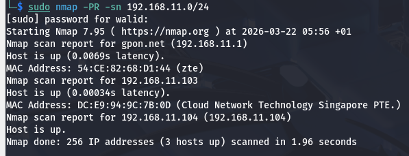
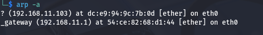
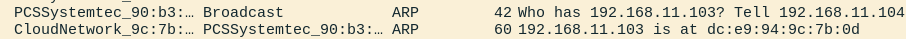

---

### 2. Service Identification & Modbus TCP Verification

Targeted port scanning was conducted on port **502/TCP** to verify Modbus service availability:

```bash
nmap -p 502 -sV --script modbus-discover 192.168.11.103
```

* **Scan Findings:**
  - **Host IP:** `192.168.11.103`
  - **Port 502/TCP:** `OPEN`
  - **Service:** `modbus` (Modbus TCP Server / OpenPLC Runtime)
  - **Device Identification:** Confirmed active listening Modbus slave instance ready for communication.

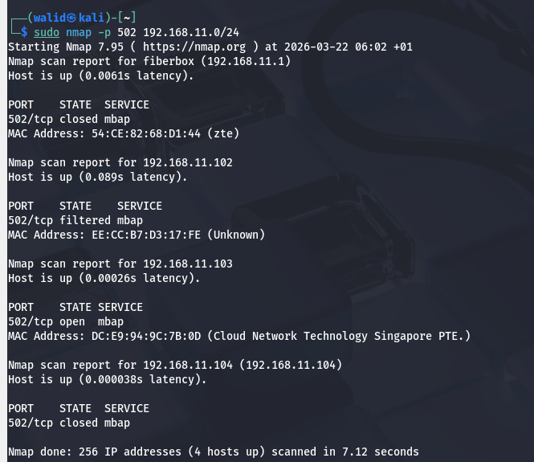

---

### 3. Traffic Analysis with Wireshark

Packet capture was performed using Wireshark filtered for Modbus TCP traffic (`modbus` or `tcp.port == 502`).

* **Observed Protocol Characteristics:**
  - **MBAP Header:** Modbus Application Protocol header containing Transaction Identifier, Protocol Identifier (`0x0000` for Modbus TCP), Length, and Unit Identifier (`Slave ID: 1`).
  - **Function Codes:**
    - `FC01` (Read Coils): Polling output states `%QX0.0` through `%QX1.3`.
    - `FC02` (Read Discrete Inputs): Polling physical safety inputs `%IX0.0` through `%IX0.2`.
    - `FC05` (Write Single Coil): Commands sent from ScadaBR to modify coil values (e.g., `START` command).
  - **Vulnerability Highlight:** Telemetry and control commands are transmitted in cleartext without encryption, authentication, or integrity checks.

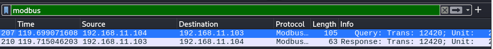

---

## 📊 Identification & Synthesis Results

The following table synthesizes the discovered OT assets, protocol attributes, and identified security findings:

| Asset / Parameter | Value / Detail | Security Assessment |
|---|---|---|
| **Target PLC IP** | `192.168.11.103` | Identified via low-overhead ARP discovery |
| **Industrial Service** | Modbus TCP (Port `502/TCP`) | Open and exposed without authentication |
| **PLC Architecture** | OpenPLC Runtime v4 (IEC 61131-3) | SoftPLC running on Linux host |
| **SCADA Platform** | ScadaBR (Modbus IP Master) | Java/Tomcat HMI polling at regular intervals |
| **Protocol Security** | Plaintext RFC 1157 / Modbus TCP | No encryption, susceptible to eavesdropping |
| **Authentication** | None | Any host on the network can issue write commands (`FC05`/`FC15`) |
| **Integrity Checks** | Basic TCP checksum only | No cryptographic MAC or digital signatures |

---

## 🛡️ Recommended Mitigation & Hardening

To secure the OT environment against unauthorized access, network eavesdropping, and spoofing attacks, the following hardening controls align with **IEC 62443** and the **Purdue Model**:

1. **Network Segmentation & Zoning (Purdue Level 1 / Level 2):**
   - Isolate PLC controllers (Level 1) and SCADA HMIs (Level 2) into dedicated OT VLANs.
   - Restrict traffic between IT and OT networks using industrial firewalls with strict stateful inspection rules.

2. **Industrial Deep Packet Inspection (DPI) Firewalls:**
   - Deploy firewalls capable of Modbus TCP DPI (e.g., Snort/Suricata with Modbus rules) to enforce read-only policies for unauthorized SCADA clients and block unexpected Function Codes.

3. **Secure Communications & Tunnels:**
   - Encapsulate unencrypted Modbus TCP traffic within IPsec or TLS tunnels (e.g., Modbus Security / TLS) when traversing untrusted network segments.

4. **OT Intrusion Detection System (IDS):**
   - Implement passive OT monitoring tools (e.g., Wazuh, Malcolm, or Suricata) to detect abnormal polling rates, unauthorized Modbus write commands, or rogue scanning devices.

5. **Access Control & Host Hardening:**
   - Restrict OpenPLC Runtime web management (`http://localhost:8080`) access using strong authentication and firewall local rules.
   - Disable unused services, protocols, and network interfaces on host operating systems.