# IDS/ICS Lab: Detecting Modbus TCP Attacks with Suricata

This laboratory implements an Intrusion Detection System (IDS) solution based on **Suricata** to monitor, analyze, and alert on industrial **Modbus TCP** traffic (port 502) within an OT/ICS environment.

## Table of Contents
1. [Part 01: Environment Setup and Traffic Validation](#part-01-environment-setup-and-traffic-validation)
   * [1. Network Architecture](#1-network-architecture)
   * [2. PLC Interface (Modbus Slave)](#2-plc-interface-modbus-slave)
   * [3. Probe Validation Test (Generic Rule)](#3-probe-validation-test-generic-rule)
2. [Part 02: Advanced Detection Rules and Attack Simulation](#part-02-advanced-detection-rules-and-attack-simulation)
   * [1. Complete Rules File](#1-complete-rules-file-etcsuricatarulesmodbusrules)
   * [2. Rules, Attacks, and Detections Detail](#2-rules-attacks-and-detections-detail)
3. [Part 03: Industrial IDS Analysis: Digital Bond Rules & PCAP Filtering](#part-03-industrial-ids-analysis-digital-bond-rules--pcap-filtering)
   * [1. Concept of Digital Bond SCADA IDS Rules](#1-concept-of-digital-bond-scada-ids-rules)
   * [2. Rule Integration & Configuration](#2-rule-integration--configuration)
   * [3. Mechanism of PCAP Filtering in Suricata](#3-mechanism-of-pcap-filtering-in-suricata)
   * [4. Log Output & Verification](#4-log-output--verification)
4. [Analysis & Limitations](#analysis--limitations)
5. [Tools Used](#tools-used)

---

## Part 01: Environment Setup and Traffic Validation

### 1. Network Architecture
The laboratory consists of three key entities:
* **Attacking Machine (Kali Linux)**: Generates traffic and SCADA attack simulations.
* **Server / PLC Simulation (Modbus Slave)**: Simulates the industrial equipment (PLC/Automaton) at address `10.10.1.2`, Unit ID **133**.
* **IDS Probe (Suricata on Ubuntu)**: Intercepts and analyzes network traffic in real-time.


---

### 2. PLC Interface (Modbus Slave)
The state of the registers and the memory mapping configured on the **Modbus Slave** simulator is shown below — this is the reference state used throughout the lab to confirm that each simulated attack actually reaches its intended target.

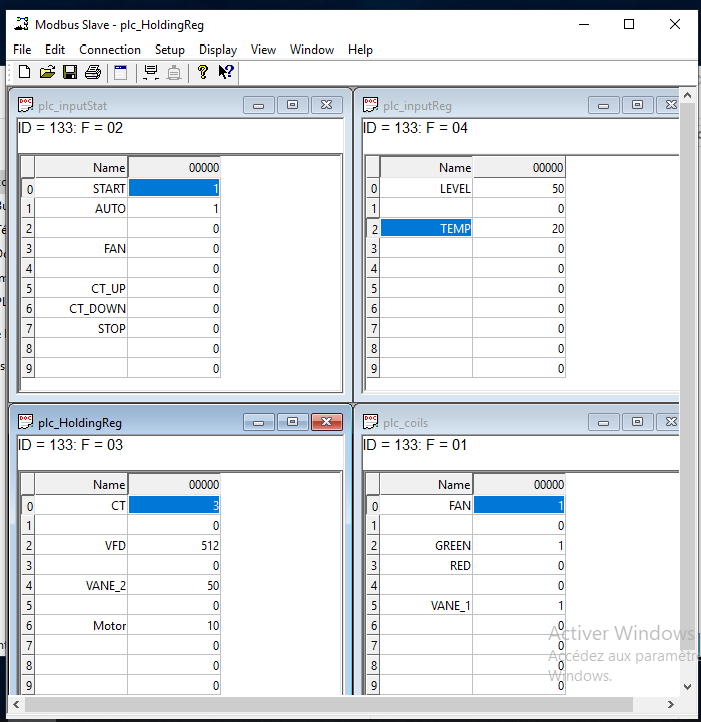

---

### 3. Probe Validation Test (Generic Rule)
To verify the proper functioning of the application inspection and Suricata log generation, a generic Modbus traffic detection rule was applied in `/etc/suricata/rules/modbus.rules`:

```suricata
alert modbus any any -> any any (msg:"Modbus traffic detected"; flow:established; sid:1000000; rev:1;)
```

This baseline rule has no filtering condition beyond a successfully established Modbus flow — its only purpose is to confirm that Suricata's Modbus application-layer parser is active and that alerts are correctly written to `/var/log/suricata/fast.log` before moving on to more specific detection logic.

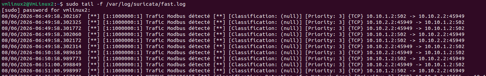

---

## Part 02: Advanced Detection Rules and Attack Simulation
This section details the 6 implemented Suricata security rules, along with the execution of attacks from Kali Linux and the verification of interceptions in the Suricata logs.

### 1. Complete Rules File (`/etc/suricata/rules/modbus.rules`)
Here is the exact content of the rules file configured on the Suricata probe:

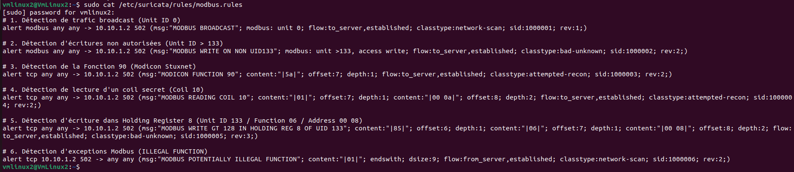

### 2. Rules, Attacks, and Detections Detail

#### Rule 1: Broadcast traffic detection (sid:1000001)

```suricata
alert modbus any any -> 10.10.1.2 502 (msg:"MODBUS BROADCAST"; modbus: unit 0; flow:to_server,established; classtype:network-scan; sid:1000001; rev:1;)
```
* **Description:** Identifies the use of Unit ID 0 (Modbus broadcast address). In an industrial environment, broadcast requests are typically used during network scanning or reconnaissance phases.
* **Operation:** Analyzes the MBAP header at the Modbus application layer to verify if the Unit ID field (7th byte) equals 0.

The attack traffic is generated from Kali by sending a Modbus request with Unit ID 0 against the target PLC:

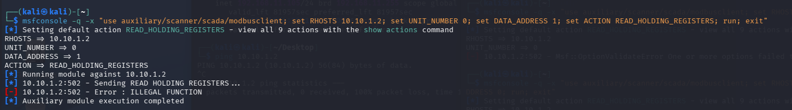

Suricata raises the corresponding alert in `fast.log`:

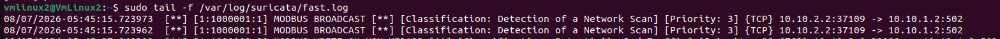

#### Rule 2: Unauthorized writes detection (sid:1000002)

```suricata
alert modbus any any -> 10.10.1.2 502 (msg:"MODBUS WRITE ON NON UID1"; modbus: unit >1, access write; flow:to_server,established; classtype:bad-unknown; sid:1000002; rev:1;)
```
* **Description:** Alerts on any write attempt (state or setpoint modification) targeting an equipment with a Unit ID greater than 1. It protects remote PLCs against unauthorized alterations.
* **Operation:** Inspects the combination of the Unit ID field (`unit >1`) with a Modbus state modification function (`access write`).

The attack is a write request issued from Kali against a Unit ID greater than 1:

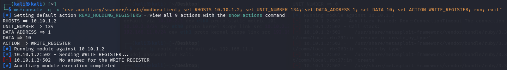

Interception in the Suricata logs:

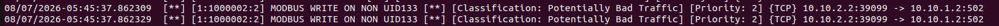

#### Rule 3: Function 90 Detection - Modicon (sid:1000003)

```suricata
alert modbus any any -> 10.10.1.2 502 (msg:"MODICON FUNCTION 90"; modbus: function 90; flow:to_server,established; classtype:attempted-recon; sid:1000003; rev:1;)
```
* **Description:** Alerts on the execution of function code 90 (0x5A), a proprietary Schneider/Modicon command primarily exploited by attack frameworks (e.g., Metasploit's `modicon_stux_transfer` module, demonstrated in Lab 02) for firmware transfers or halting the processor.
* **Operation:** Reads the Function Code field of the Modbus PDU and triggers an alert if its value equals 90.

The Kali machine injects a Function 90 request, reproducing the same Stuxnet-style attack path shown in Lab 02:

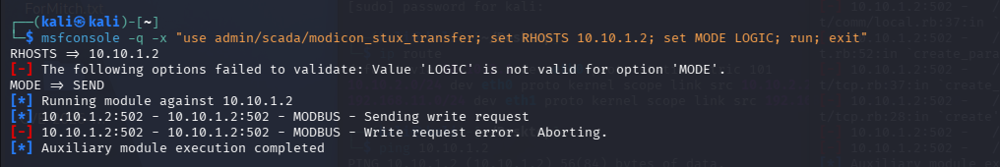

Interception in the Suricata logs:

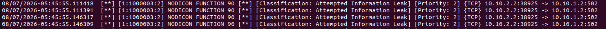

#### Rule 4: Sensitive Coil read detection (sid:1000004)

```suricata
alert modbus any any -> 10.10.1.2 502 (msg:"MODBUS READING COIL 10"; modbus: access read coils, address 10; flow:to_server,established; classtype:attempted-recon; sid:1000004; rev:1;)
```
* **Description:** Detects the specific reading of Coil 10, considered a critical state variable (e.g., state of a valve or safety relay) that must remain confidential.
* **Operation:** Filters Read Coils requests (Function 01) explicitly targeting address 10.

The attack is a targeted `READ_COILS` request against address 10, issued from Kali:

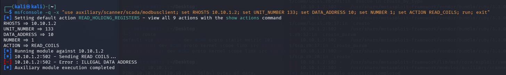

Interception in the Suricata logs:

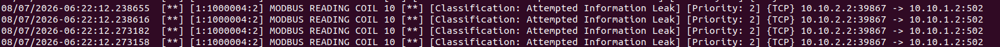

#### Rule 5: Out-of-bounds values in registers detection (sid:1000005)

```suricata
alert modbus any any -> 10.10.1.2 502 (msg:"MODBUS WRITE GT 128 IN HOLDING REG 8 OF UID 133"; modbus: unit 133, access write holding, address 8, value >128; flow:to_server,established; classtype:bad-unknown; sid:1000005; rev:1;)
```
* **Description:** Alerts when a value greater than 128 is injected into Holding Register 8 of the PLC (Unit ID **133**, matching the real Modbus Slave configuration used throughout this lab series). This rule protects the process against setpoint injection attacks that could physically damage the installation — the same category of attack as the `Motor = 500` write demonstrated in Lab 02.
* **Operation:** Evaluates the transmitted value during a write command (`access write holding`) to address 8 and triggers an alert if `value > 128`.

The attack writes a value greater than 128 to Holding Register 8, issued from Kali:

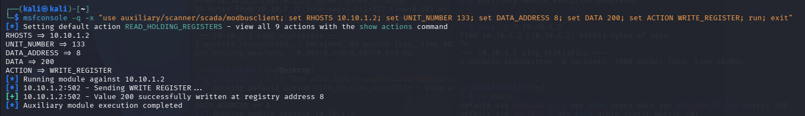

Interception in the Suricata logs:

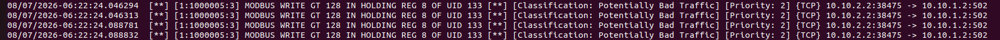

#### Rule 6: Modbus exception responses detection (sid:1000006)

```suricata
alert tcp any any -> 10.10.1.2 502 (msg:"MODBUS POTENTIALLY ILLEGAL FUNCTION"; content:"|01|"; endswith; dsize:9; flow:from_server,established; classtype:network-scan; sid:1000006; rev:1;)
```
* **Description:** Inspects the return flow (`flow:from_server`) from the PLC to the client to detect application exceptions (e.g., ILLEGAL FUNCTION). Repeated exceptions often indicate a function scan or fuzzing of SCADA equipment.
* **Operation:** A Modbus TCP exception response is always exactly 9 bytes long: 7 bytes of MBAP header plus 1 function-code byte plus 1 exception-code byte. This rule deliberately matches on raw TCP content (`dsize:9` + `content:"|01|"` at the end of the payload) rather than the `modbus` keyword, so it fires on the exception code `01` (Illegal Function) regardless of which function code triggered it.

The exception traffic is generated from Kali by sending malformed or unsupported function codes to the PLC (function scanning/fuzzing behavior):

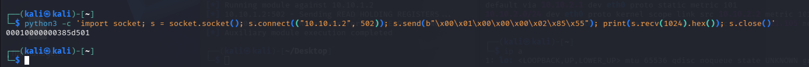

Interception in the Suricata logs:

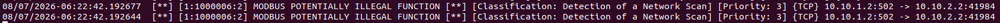

---

## Part 03: Industrial IDS Analysis: Digital Bond Rules & PCAP Filtering

### 1. Concept of Digital Bond SCADA IDS Rules
Legacy industrial protocols—such as **Modbus TCP**—were designed without native security features like authentication or encryption. Consequently, Programmable Logic Controllers (PLCs) blindly execute valid command structures sent across the network.

The **Digital Bond** SCADA-IDS rule set addresses this risk through deep protocol inspection and behavioral anomaly detection:
* **Dangerous Function Code Monitoring:** Detects control commands capable of disrupting industrial processes, such as forcing an automaton into *Listen Only Mode* or triggering remote device restarts.
* **Protocol Abuse & Anomaly Detection:** Identifies malformed packets, incorrect length fields, or unauthorized payloads traversing standard industrial ports (e.g., TCP 502), which often signify vulnerability scanning, fuzzing, or reconnaissance activities.
* **Priority Classification:** Categorizes events based on operational risk to help security teams prioritize high-severity industrial threats.

---

### 2. Rule Integration & Configuration
To enable the Digital Bond signature set alongside custom lab rules, the corresponding rule file must be declared and enabled within Suricata's main configuration file (`suricata.yaml`).

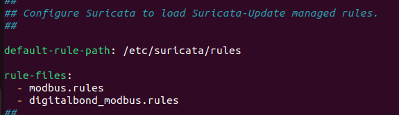

---

### 3. Mechanism of PCAP Filtering in Suricata
When Suricata processes historical network traffic offline via a packet capture file, it passes the data through a multi-stage inspection pipeline:
```text
[ PCAP File ] ---> [ Packet Decoder ] ---> [ Stream Engine (TCP Reassembly) ] ---> [ Application Layer (Modbus Parser) ] ---> [ Detection Engine (Rules) ] ---> [ Outputs (fast.log / eve.json) ]
```

1. **Offline Packet Ingestion (`-r`):** Suricata ingests packets sequentially from the capture file, simulating real-time network conditions.
2. **Stream Reassembly:** Because Modbus runs over TCP, Suricata's stream engine reconstructs fragmented segments and tracks connection states to analyze full transactions rather than isolated packets.
3. **Application-Layer Parsing:** The engine extracts internal Modbus protocol fields, including Unit IDs (`UID`), transaction identifiers, function codes, register addresses, and data quantities.
4. **Signature Matching:** The decoded transaction is evaluated against all active rule files (combining custom lab rules and Digital Bond signatures). Matching events trigger formatted log entries.

The pipeline is exercised by running Suricata directly against a capture file instead of a live interface:

```bash
sudo suricata -c /etc/suricata/suricata.yaml -r modbus_test_data_part1.pcap
```

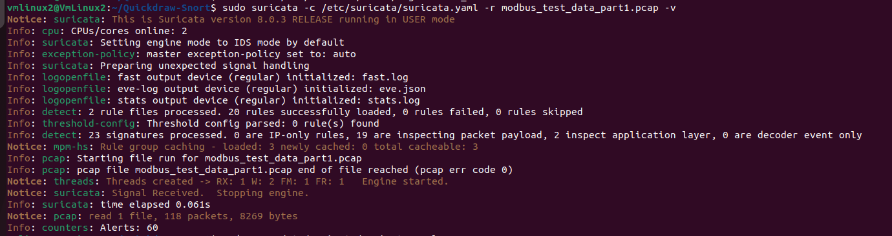

---

### 4. Log Output & Verification

Below is an excerpt from the Suricata fast log (`/var/log/suricata/fast.log`) demonstrating concurrent detections from both custom rules and Digital Bond rules during PCAP analysis:

```text
08/07/2026-08:24:12.828193  [**] [1:1111009:1] SCADA_IDS: Modbus TCP - Non-Modbus Communication on TCP Port 502 [**] [Classification: Detection of a non-standard protocol or event] [Priority: 1] {TCP} 10.10.2.2:41325 -> 10.10.1.2:502
08/07/2026-08:24:12.828193  [**] [1:1000005:3] MODBUS WRITE GT 128 IN HOLDING REG 8 OF UID 133 [**] [Classification: Potentially Bad Traffic] [Priority: 2] {TCP} 10.10.2.2:41325 -> 10.10.1.2:502
08/07/2026-08:25:15.308881  [**] [1:1000001:1] MODBUS BROADCAST [**] [Classification: Detection of a Network Scan] [Priority: 3] {TCP} 10.10.2.2:37871 -> 10.10.1.2:502
```

Both the custom lab rule (`1000005`) and a Digital Bond signature (`1111009`) fire on the same transaction stream, confirming that the two rule sets coexist correctly in the same Suricata instance without conflict.

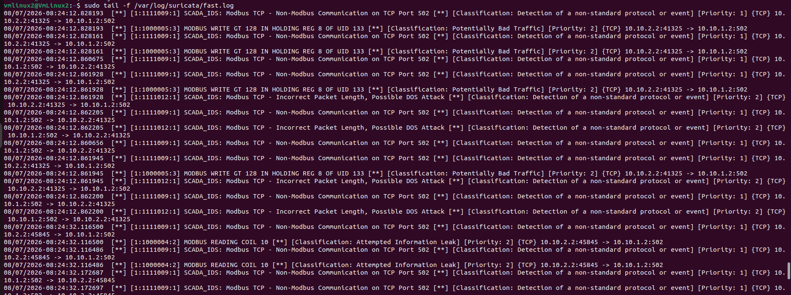

---

## Analysis & Limitations

This lab turns a recommendation made at the end of Lab 02 — *"deploy an OT-aware IDS to detect Modbus traffic anomalies"* — into a concrete implementation, closing the loop between attack and detection across the series. A few limitations are worth stating explicitly:

* **Signature-based detection only.** Every rule here matches a known pattern (a specific Unit ID, function code, address, or value threshold). None of them would catch a novel attack technique that doesn't match an existing signature, or a malicious write that stays within the "allowed" value range — behavioral/anomaly-based detection (e.g., baseline polling rate, unexpected master/slave role changes) would be needed to close that gap.
* **Rule 6's precision trade-off.** Matching on raw `dsize:9` + `content:"|01|"` is effective specifically because a Modbus TCP exception response has a fixed 9-byte length, but it is a byte-pattern match rather than a true protocol-aware match — any other 9-byte TCP payload to port 502 ending in `0x01` would also trigger it. In this lab's context (isolated Modbus-only segment) that trade-off is acceptable; on a shared or noisier segment it could produce false positives and would benefit from being scoped more tightly (e.g., paired with `flow:from_server` traffic already filtered to known Modbus conversations).
* **Rules are hard-coded to this lab's topology.** The destination IP (`10.10.1.2`) and Unit ID (`133`) are hard-coded into each rule rather than parameterized, which is appropriate for a lab of this scope but would need templating (or a rule-generation script) before reuse against a different PLC address or a multi-device segment.

---

## Tools Used

| Tool | Role |
|------|------|
| **Suricata** | Signature-based IDS engine — live interface and offline PCAP analysis |
| **Kali Linux** | Attack traffic generation (Modbus reconnaissance/write/exception traffic) |
| **Modbus Slave** | Simulated PLC target (`10.10.1.2`, Unit ID 133) |
| **Digital Bond SCADA-IDS rules** | Community Modbus/DNP3 signature set, layered on top of the custom rules |