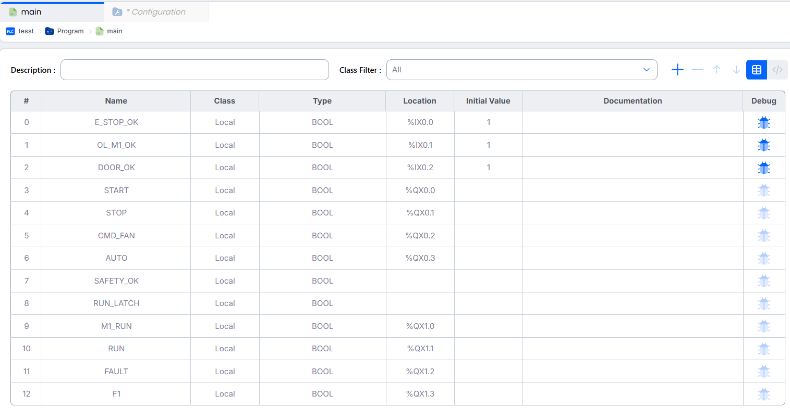

# TP01 - Sécurité OT (Operational Technology)

## Objectif

Ce travail pratique vise à mettre en place un environnement de contrôle industriel utilisant **OpenPLC** et **ScadaBR**, ainsi qu'à analyser la sécurité du réseau via des outils de reconnaissance (NMAP, Wireshark).

---

## Partie 01 : Installation de OpenPLC

